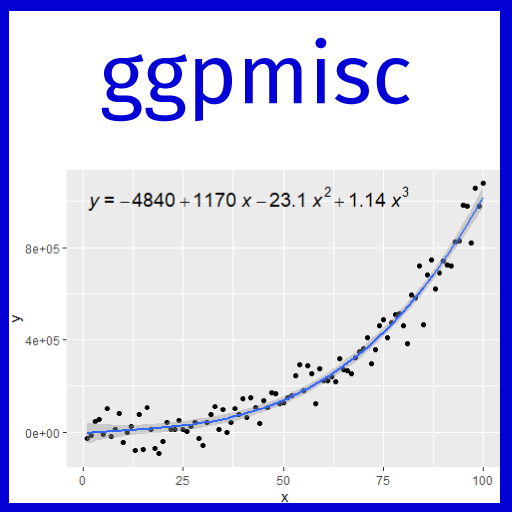

---
output:
  github_document:
    html_preview: TRUE
---

```{r readme-01, echo = FALSE}
knitr::opts_chunk$set(
  fig.asp = 2 / 3,
  collapse = TRUE,
  comment = "#>",
  fig.path = "man/figures/README-"
)
```

# ggpmisc 
## Miscellaneous Extensions to 'ggplot2'

<!-- badges: start -->
[](https://cran.r-project.org/package=ggpmisc) 
[](https://cran.r-project.org/web/checks/check_results_ggpmisc.html)
[](https://aphalo.r-universe.dev/ggpmisc)
[](https://github.com/aphalo/ggpmisc/actions/workflows/R-CMD-check.yaml)
[](https://docs.r4photobiology.info/ggpmisc/)
[](https://doi.org/10.32614/CRAN.package.ggpmisc)
<!-- badges: end -->

**Current failure of `R-CMD-check.yaml` at GitHub is due to small visual
differences in plots between versions of R, which are not fully addressed by 
the currently implemented versioning of graphical "snaps" used as reference
for tests.**

## Purpose

Package '**ggpmisc**' (Miscellaneous Extensions to 'ggplot2') is a set of
extensions to R package 'ggplot2' (>= 3.0.0) with emphasis on annotations and
plotting related to fitted models. Estimates from model fit objects can be
displayed in ggplots as text, model equations, ANOVA and summary table.
Predicted values, residuals, deviations and weights can be plotted for various 
model fit functions. Linear models, polynomial regression, quantile regression, major axis regression, non-linear regression and different approaches to robust and resistant regression, as well as user-defined wrapper functions based on them are supported. In addition, all model fit functions returning objects for which accessors are available or supported by package 'broom' and its extensions are also supported but not as automatically. Labelling based on multiple comparisons supports various _P_ adjustment methods and contrast schemes. Annotation of peaks and valleys in time series, and scales for volcano and quadrant plots as used for gene expression data are also provided. Package '**ggpmisc**' continues to give access to extensions moved as of version 0.4.0
to package ['**ggpp**'](https://docs.r4photobiology.info/ggpp/).

## Philosophy

Package '**ggpmisc**' is consistent with the grammar of graphics, and opens new
possibilities retaining the flexibility inherent to this grammar. Its aim is not
to automate plotting or annotations in a way suitable for fast data exploration
by use of a "fits-all-sizes" predefined design. Package '**ggpmisc**' together
with package '**ggpp**', provide new layer functions, position functions and
scales. In fact, these packages follow the tenets of the grammar even more
strictly than '**ggplot2**' in the distinction between geometries and
statistics. The new statistics in '**ggpmisc**' focus mainly on model fitting,
including multiple comparisons among groups. The default annotations are those
most broadly valid and of easiest interpretation. We follow R's approach of
expecting that users know what they need or want, and will usually want to
adjust how results from model fits are presented both graphically and textually.
The approach and mechanics of plot construction and rendering remain unchanged
from those implemented in package ['**ggplot2**'](https://ggplot2.tidyverse.org/).

## Statistics

Statistics that help with reporting the results of model fits are:

| Statistic               | Returned values<br> (*default geometry*)          | Methods                                      |
|:------------------------|:--------------------------------------------------|:---------------------------------------------|
| **Model equation**      | _parameter estimates_                             |                                              |
| `stat_poly_eq()`        | equation, *R*<sup>2</sup>, *P*, etc. (`text_npc`) | lm, rlm, lqs, gls, ma, sma, etc. (1, 2, 7)   |
| `stat_ma_eq()`          | equation, *R*<sup>2</sup>, *P*, etc. (`text_npc`) | lmodel2 (6, 7)                               |
| `stat_quant_eq()`       | equation, *P*, etc. (`text_npc`)                  | rq (1, 3, 4, 7)                              |
| `stat_distrmix_eq()`   | equation(s) (`text_npc`)                          | normalmixEM (2, 7)                           |
| `stat_correlation()`    | correlation, *P*-value, CI (`text_npc`)           | Pearson (*t*), Kendall (*z*), Spearman (*S*) |
| `stat_fit_glance()`     | equation, *R*<sup>2</sup>, *P*, etc. (`text_npc`) | those supported by 'broom'                   |
| **Model line**          | _predicted and fitted values_                     |                                              |
| `stat_poly_line()`      | line + conf. (`smooth`)                           | lm, rlm, lqs, gls, ma, sma, etc. (1, 2, 7)   |
| `stat_ma_line()`        | line + slope conf. (`smooth`)                     | lmodel2 (6, 7)                               |
| `stat_quant_line()`     | line + conf. (`smooth`)                           | rq, rqss (1, 3, 4, 7)                        |
| `stat_quant_band()`     | line + band, 2 or 3 quantiles (`smooth`)          | rq, rqss (1, 4, 5, 7)                        |
| `stat_distrmix_line()` | lines(s) (`line`)                                 | normalmixEM (2, 7)                           |
| `stat_fit_augment()`    | predicted and other values (`smooth`)             | those supported by 'broom'                   |
| `stat_fit_fitted()`     | fitted values (`point`)                           | lm, rlm, lqs, rq, gls, ma, sma, etc. (1, 2, 4, 7, 9) |
| `stat_fit_deviations()` | deviations from observations (`segment`)          | lm, rlm, lqs, rq, gls, ma, sma, etc. (1, 2, 4, 7, 9) |
| **Model table**         | _parameter estimates and significance_            |                                              |
| `stat_fit_tb()`         | ANOVA and summary tables (`table_npc`)            | those supported by 'broom'                   |
| `stat_fit_tidy()`       | fit results, e.g., for equation (`text_npc`)      | those supported by 'broom'                   |
| **Contrasts**           | _Tukey, Dunnet and arbitrary pairwise_            |                                              |
| `stat_multcomp()`       | Multiple comparisons (`label_pairwise` or `text`) | those supported by `glht` (1, 2, 7)          |
| **Residuals**           | _model fit residuals_                             |                                              |
| `stat_fit_residuals()`  | residuals (`point`)                               | lm, rlm, lqs, rq, gls, ma, sma, etc. (1, 2, 4, 7, 9) |

: Notes:  (1) *weight* aesthetic supported; (2) user defined model fit functions
including wrappers of supported methods are accepted even if they modify the
model *formula* (additional model fitting methods are likely to work, but have
not been tested); (3) unlimited quantiles supported; (4) user defined fit
functions that return an object of a class derived from `rq` or `rqs` are
supported even if they override the 
statistic's *formula* and/or *quantiles*
argument; (5) two and three quantiles supported; (6) user defined fit functions
that return an object of a class derived from `lmodel2` are supported; (7)
`method` arguments support colon based notation; (8) model fit functions if method
`residuals()` defined for returned value; (9) model fit functions if method
`fitted()` is defined for the returned value.

Statistics `stat_peaks()` and `stat_valleys()` can be used to highlight and/or
label global and/or local maxima and minima in a plot.

## Aesthetics and scales

Scales `scale_x_logFC()`, `scale_y_logFC()`, `scale_colour_logFC()` and
`scale_fill_logFC()` easy the plotting of log fold change data. Scales
`scale_x_Pvalue()`, `scale_y_Pvalue()`, `scale_x_FDR()` and `scale_y_FDR()` are
suitable for plotting _p_-values and adjusted _p_-values or false discovery rate
(FDR). Default arguments are suitable for volcano and quadrant plots as used for
transcriptomics, metabolomics and similar data.

Scales `scale_colour_outcome()`, `scale_fill_outcome()` and 
`scale_shape_outcome()` and functions `outome2factor()`, `threshold2factor()`,
`xy_outcomes2factor()` and `xy_thresholds2factor()` used together make it 
easy to map ternary numeric outputs and logical binary outcomes to color,
fill and shape aesthetics. Default arguments are suitable for volcano,
quadrant and other plots as used for genomics, metabolomics and similar data.

## Migrated

Several geoms and other extensions formerly included in package 'ggpmisc' until version 0.3.9
were migrated to package 'ggpp'. They are still available when 'ggpmisc' is
loaded, but the documentation now resides in the new package ['**ggpp**'](https://docs.r4photobiology.info/ggpp/). 
[](https://cran.r-project.org/package=ggpp)
[](https://aphalo.r-universe.dev/ggpp)
<a href="https://docs.r4photobiology.info/ggpp/"></a>

Functions for the manipulation of layers in ggplot objects, together with statistics and
geometries useful for debugging extensions to package 'ggplot2', included in
package 'ggpmisc' until version 0.2.17 are now in package ['**gginnards**'](https://docs.r4photobiology.info/gginnards/).
[](https://cran.r-project.org/package=gginnards) 
[](https://aphalo.r-universe.dev/gginnards)
<a href="https://docs.r4photobiology.info/gginnards/"></a>

## Examples

```{r readme-02, message=FALSE}
library(ggpmisc)
library(ggrepel)
library(broom)
```

In the first two examples we plot data such that we map a factor to the _x_
aesthetic and label it with the adjusted _P_-values for multitle comparision
using "Tukey" contrasts.

```{r readme-03a}
#| fig.cap: >
#|   **Figure 1.** Boxplots with outcome from paiwise contrasts using
#|   Tukey's HSD (honestly significant difference) as criterion with
#|    $\alpha = 0.05$.
#|       
ggplot(mpg, aes(factor(cyl), cty)) +
  geom_boxplot(width = 0.33) +
  stat_multcomp(label.type = "letters") +
  expand_limits(y = 0)
```

Using "Dunnet" contrasts and "bars" to annotate individual contrasts with the adjusted _P_-value, here using Holm's method.

```{r readme-03b}
#| fig.cap: >
#|   **Figure 2.** Boxplots with outcome from paiwise 
#|   Dunnet contrasts using Holms' _P_-adjustment. The
#|   adjusted _P_-values are shown for each pairwise contrast.
#|   An ANOVA is first fitted and subsequently its output is
#|   used for pairwise contrasts within the _stat_. Labels are
#|   formatted automatically. 
#|       
ggplot(mpg, aes(factor(cyl), cty)) +
  geom_boxplot(width = 0.33) +
  stat_multcomp(contrasts = "Dunnet",
                p.adjust.method = "holm",
                size = 2.75) +
  expand_limits(y = 0)
```

In the third example we add the equation for a linear regression, the adjusted
coefficient of determination and _P_-value to a plot showing the observations
plus the fitted curve, deviations and confidence band. We use `stat_poly_eq()`
together with `use_label()` to assemble and map the desired annotations.

```{r readme-04}
#| fig.cap: >
#|   **Figure 3.** Scatter plot of obsevations with a second degree 
#|   polynomial **fitted by OLS**. Fitted model line with 95% confidence band is
#|   shown. Deviations for each observation are highlighted as red segments.
#|   Fitted model equation, $R^2$ and _P_-value are shown as annotations.
#|   Model fitted within _stats_ with labels generated automatically.
#|       
formula <- y ~ x + I(x^2)
ggplot(cars, aes(speed, dist)) +
  geom_point() +
  stat_fit_deviations(formula = formula, colour = "red") +
  stat_poly_line(formula = formula) +
  stat_poly_eq(use_label(c("eq", "adj.R2", "P")), formula = formula)
```

The same figure as in the third example but this time annotated with the
ANOVA table for the model fit. We use `stat_fit_tb()` which can be used to add
ANOVA or summary tables.

```{r readme-05}
#| fig.cap: >
#|   **Figure 4.** The same base plot as in Figure 3, but annotated
#|   with an inset ANOVA table for the fitted model. 
#|   Model fitted within _stats_ with table generated automatically.
#|   Some column and row headings replaced by user-provided
#|   character strings, some of them parsed as plotmath expressions.
#|       
formula <- y ~ x + I(x^2)
ggplot(cars, aes(speed, dist)) +
  geom_point() +
  stat_poly_line(method = "lm", formula = formula) +
  stat_fit_tb(method = "lm",
              method.args = list(formula = formula),
              tb.type = "fit.anova",
              tb.vars = c(Effect = "term",
                          "df",
                          "M.S." = "meansq",
                          "italic(F)" = "statistic",
                          "italic(P)" = "p.value"),
              tb.params = c(x = 1, "x^2" = 2),
              label.y = "top", label.x = "left",
              size = 3.5,
              parse = TRUE)
```

The same figure as in the third example but this time using quantile regression, median in this example.

```{r readme-04b, warning=FALSE}
#| fig.cap: >
#|   **Figure 5.** Same scatter plot of obsevations as in Figures 3 and 4, 
#|   but with a the second degree 
#|   polynomial **fitted by quantile regression**. Fitted model line with 95% 
#|   confidence band shown.
#|   Fitted model equation shown, $\rho$ and the number of observations
#|   shown as annotations.
#|   Model fitted within _stats_ with labels generated automatically.
#|       
formula <- y ~ x + I(x^2)
ggplot(cars, aes(speed, dist)) +
  geom_point() +
  stat_quant_line(formula = formula, quantiles = 0.5) +
  stat_quant_eq(use_label("eq", "rho", "n"),
                formula = formula, quantiles = 0.5)
```

Band highlighting the region between both quartile regressions and a line for the median regression.

```{r readme-04c, warning=FALSE}
#| fig.cap: >
#|   **Figure 6.** The same scatter plot of obsevations as in Figures 3 to
#|   5 but with three second degree polynomials **fitted by quantile 
#|   regression**, for the median and the quartiles. 
#|   The line shows the model fit for the median line, and the band delimits
#|   the quartiles.
#|   The three fitted model equations are shown as annotations.
#|   Model fitted within _stats_ with labels generated automatically.
#|       
formula <- y ~ x + I(x^2)
ggplot(cars, aes(speed, dist)) +
  geom_point() +
  stat_quant_band(formula = formula) +
  stat_quant_eq(formula = formula, quantiles = c(0.25, 0.5, 0.75))
```

A quadrant plot with counts and labels, using `geom_text_repel()` from package
'ggrepel'.

```{r}
#| fig.cap: >
#|   **Figure 7.** A quadrant plot as used to compare gene expression
#|   under two conditions or in two genotypes. A fraction, 2% in this case,
#|   of all genes are labelled, with those in the least dense
#|   regions of the scatter plot selected automatically. The manually set
#|   bandwidth, `h = 3` in this case, has a large effect on which 
#|   observations are highlighted and labelled.
#|       
ggplot(quadrant_example.df, aes(logFC.x, logFC.y)) +
  geom_point(alpha = 0.3) +
  geom_quadrant_lines() +
  stat_quadrant_counts() +
  stat_dens2d_filter(color = "red", 
                     keep.fraction = 0.02, h = 3) +
  stat_dens2d_labels(aes(label = gene), 
                     keep.fraction = 0.02, h = 3,
                     geom = "text_repel", 
                     size = 2, 
                     colour = "red") +
  scale_x_logFC(name = "Transcript abundance after A%unit") +
  scale_y_logFC(name = "Transcript abundance after B%unit",
                expand = expansion(mult = 0.2))
```

A time series using the specialized version of
`ggplot()` that converts the time series into a tibble and maps the `x`
and `y` aesthetics automatically. We also highlight and label the peaks
using `stat_peaks()`.

```{r readme-03}
#| fig.cap: >
#|   **Figure 8.** Plot of the `lynx` time series. The time series was converted
#|   on-the-fly into a data frame and _x_ and _y_ mappings set automatically.
#|   Automation relies on `ggplot()` being a generic function exported by 
#|   package 'ggplot2' and the definition of method specializations in 'ggpp'.
#|   Peaks are highlited and annotated with the year extracted and formatted
#|   by the _stat_. 
#|       
ggplot(lynx, as.numeric = FALSE) + geom_line() +
  stat_peaks(colour = "red") +
  stat_peaks(geom = "text", colour = "red", angle = 66,
             hjust = -0.1, x.label.fmt = "%Y") +
  stat_peaks(geom = "rug", colour = "red", sides = "b") +
  expand_limits(y = 8000)
```

## Installation

Installation of the most recent stable version from CRAN (sources, Mac and Win
binaries):

```{r cran-instalaltion, eval=FALSE}
install.packages("ggpmisc")
```

Installation of the current unstable version from R-Universe CRAN-like
repository (binaries for Mac, Win, Webassembly, and Linux, as well as sources
available):

```{r, eval=FALSE}
install.packages("ggpmisc",
                 repos = c("https://aphalo.r-universe.dev",
                           "https://cloud.r-project.org"))
```

Installation of the current unstable version from GitHub (from sources):

```{r bb-instalation, eval=FALSE}
# install.packages("remotes") # nolint: commented_code_linter.
remotes::install_github("aphalo/ggpmisc")
```

## Documentation 

HTML documentation for the package, including help pages and the _User Guide_,
is available at [https://docs.r4photobiology.info/ggpmisc/](https://docs.r4photobiology.info/ggpmisc/).

News about updates are regularly posted at [https://www.r4photobiology.info/](https://www.r4photobiology.info/).

Chapter 7 in Aphalo (2020) and Chapter 9 in Aphalo (2024) explain basic concepts
of the grammar of graphics as implemented in 'ggplot2' as well as extensions to
this grammar including several of those made available by packages 'ggpp' and
'ggpmisc'. Information related to the book is available at
[https://www.learnr-book.info/](https://www.learnr-book.info/).

## Contributing

Please report bugs and request new features at [https://github.com/aphalo/ggpmisc/issues](https://github.com/aphalo/ggpmisc/issues). Pull requests are welcome at [https://github.com/aphalo/ggpmisc](https://github.com/aphalo/ggpmisc).

## Citation

If you use this package to produce scientific or commercial publications, please cite according to:

```{r}
citation("ggpmisc")
```

## Acknowledgement

Being an extension to package 'ggplot2', some of the code in package 'ggpmisc' has been created by using as a template that from layer functions and scales in 'ggplot2'. The user interface of 'ggpmisc' aims at being as consistent as possible with 'ggplot2' and the layered grammar of graphics (Wickham 2010). New features added in 'ggplot2' are added when relevant to 'ggpmisc', such as support for `orientation` for flipping of layers. This package does consequently indirectly include significant contributions from several of the authors and maintainers of 'ggplot2', listed at (https://ggplot2.tidyverse.org/).

## References

Aphalo, Pedro J. (2024) _Learn R: As a Language._ 2ed. The R Series. Boca Raton and London: Chapman and Hall/CRC Press. ISBN: 9781032516998. 466 pp. 

Aphalo, Pedro J. (2020) _Learn R: As a Language._ 1ed. The R Series. Boca Raton and London: Chapman and Hall/CRC Press. ISBN: 9780367182533. 350 pp. 

Wickham, Hadley. 2010. “A Layered Grammar of Graphics.” Journal of Computational and Graphical Statistics 19 (1): 3–28. https://doi.org/10.1198/jcgs.2009.07098.

## License

© 2016-2026 Pedro J. Aphalo (pedro.aphalo@helsinki.fi). Released under the GPL, version 2 or greater. This software carries no warranty of any kind.
