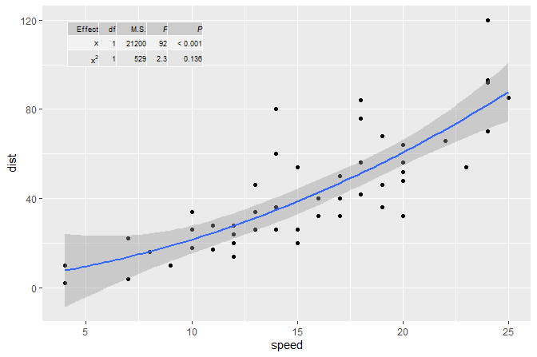

<!-- README.md is generated from README.Rmd. Please edit that file -->

# ggpmisc

[](https://cran.r-project.org/package=ggpmisc)
[](https://cran.r-project.org/web/checks/check_results_ggpmisc.html)

Package ‘**ggpmisc**’ (Miscellaneous Extensions to ‘ggplot2’) is a set
of extensions to R package ‘ggplot2’ (\>= 3.0.0) with emphasis on
annotations and highlighting related to fitted models and data
summaries. To complement these, the widely useful `geom_table()` and
`stat_fmt_tb()` are defined as well as `ggplot` constructors for time
series objects. The provided `ggplot.ts()` and `ggplot.xts()` use
`try_tibble()` which is also exported and accepts objects of additional
classes as input.

Statistics useful for highlighting and/or annotating individual data
points in regions of plot panels with high/low densities of
observations. These stats are designed to work well together with
`geom_text_repel()` and `geom_label_repel()` from package ‘ggrepel’.

**Note:** Functions for the manipulation of layers in ggplot objects and
statistics and geometries that echo their data input to the R console,
earlier included in this package are now in package ‘gginnards’.

## Examples

``` r
library(ggplot2)
library(ggpmisc)
```

In the first example we plot a time series using the specialized version
of `ggplot()` that converts the time series into a tibble and maps the
`x` and `y` aesthetics automatically. We also highlight and label the
peaks using `stat_peaks`.

``` r
ggplot(lynx, as.numeric = FALSE) + geom_line() + 
  stat_peaks(colour = "red") +
  stat_peaks(geom = "text", colour = "red", angle = 66,
             hjust = -0.1, x.label.fmt = "%Y") +
  expand_limits(y = 8000)
```

<!-- -->

In the second example we add the equation for a fitted polynomial plus
the adjusted coefficient of determination to a plot showing the
observations plus the fitted curve and confidence band. We use
`stat_poly_eq()`.

``` r
formula <- y ~ x + I(x^2)
ggplot(cars, aes(speed, dist)) +
  geom_point() +
  geom_smooth(method = "lm", formula = formula) +
  stat_poly_eq(aes(label =  paste(..eq.label.., ..adj.rr.label.., sep = "~~~~")),
               formula = formula, parse = TRUE)
```

<!-- -->

The same figure as in the second example but this time annotated with
the ANOVA table for the model fit. We use `stat_fit_tb()` which can be
used to add ANOVA or summary tables.

``` r
formula <- y ~ x + I(x^2)
ggplot(cars, aes(speed, dist)) +
  geom_point() +
  geom_smooth(method = "lm", formula = formula) +
  stat_fit_tb(method = "lm",
              method.args = list(formula = formula),
              tb.type = "fit.anova",
              tb.vars = c(Effect = "term", 
                          "df",
                          "M.S." = "meansq", 
                          "italic(F)" = "statistic", 
                          "italic(P)" = "p.value"),
               label.y.npc = "top", label.x.npc = "left",
              parse = TRUE)
#> Warning in seq.default(along = x): partial argument match of 'along' to
#> 'along.with'
```

<!-- -->

## Installation

Installation of the most recent stable version from CRAN:

``` r
install.packages("ggspectra")
```

Installation of the current unstable version from Bitbucket:

``` r
# install.packages("devtools")
devtools::install_bitbucket("aphalo/ggspectra")
```

## Documentation

HTML documentation is available at
(<http://docs.r4photobiology.info/ggpmisc/>), including a *User Guide*.

News on updates to the different packages of the ‘r4photobiology’ suite
are regularly posted at (<https://www.r4photobiology.info/>).

## Contributing

Please report bugs and request new features at
(<https://bitbucket.org/aphalo/ggpmisc/issues>). Pull requests are
welcome at (<https://bitbucket.org/aphalo/ggpmisc>).

Please note that this project is released with a [Contributor Code of
Conduct](CONDUCT.md). By participating in this project you agree to
abide by its terms.

## Citation

If you use this package to produce scientific or commercial
publications, please cite according to:

``` r
citation("ggpmisc")
#> 
#> To cite ggpmisc in publications, please use:
#> 
#>   Pedro J. Aphalo. (2016) Learn R ...as you learnt your mother
#>   tongue. Leanpub, Helsinki.
#> 
#> A BibTeX entry for LaTeX users is
#> 
#>   @Book{,
#>     author = {Pedro J. Aphalo},
#>     title = {Learn R ...as you learnt your mother tongue},
#>     publisher = {Leanpub},
#>     year = {2016},
#>     url = {https://leanpub.com/learnr},
#>   }
```

## License

© 2016-2018 Pedro J. Aphalo (<pedro.aphalo@helsinki.fi>). Released under
the GPL, version 2 or greater. This software carries no warranty of any
kind.
