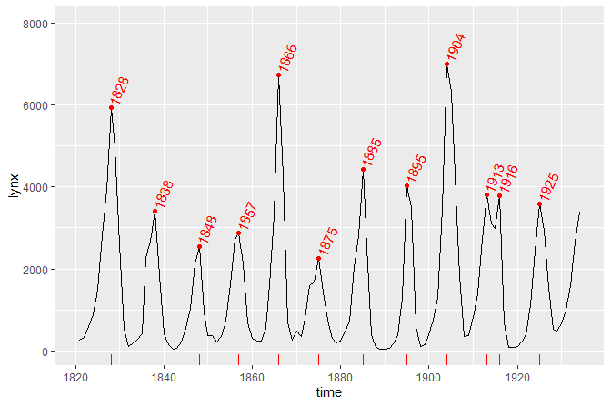
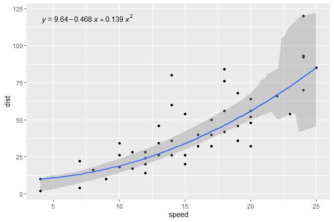

<!-- README.md is generated from README.Rmd. Please edit that file -->

# ggpmisc 

[](https://cran.r-project.org/package=ggpmisc)
[](https://github.com/aphalo/ggpmisc/actions)

## Purpose

Package ‘**ggpmisc**’ (Miscellaneous Extensions to ‘ggplot2’) is a set
of extensions to R package ‘ggplot2’ (\>= 3.0.0) with emphasis on
annotations and plotting related to fitted models. Estimates from model
fit objects can be displayed in ggplots as text, tables or equations.
Predicted values, residuals, deviations and weights can be plotted for
various model fit functions. Linear models, quantile regression and
major axis regression as well as those functions with accessors
following the syntax of package ‘broom’ are supported. Package
‘**ggpmisc**’ continues to give access to extensions moved as of version
0.4.0 to package [‘**ggpp**’](https://docs.r4photobiology.info/ggpp/).

## Statistics

Statistics that help with reporting the results of model fits are:

<table>
<colgroup>
<col style="width: 21%" />
<col style="width: 40%" />
<col style="width: 38%" />
</colgroup>
<thead>
<tr class="header">
<th>Statistic</th>
<th><code>after_stat</code> values (<em>default geometry</em>)</th>
<th>Methods</th>
</tr>
</thead>
<tbody>
<tr class="odd">
<td><code>stat_poly_eq()</code></td>
<td>equation, <em>R</em><sup>2</sup>, <em>P</em>, etc.
(<code>text_npc</code>)</td>
<td>lm, rlm (<strong>weight</strong> aesthetic fully supported)</td>
</tr>
<tr class="even">
<td><code>stat_ma_eq()</code></td>
<td>equation, <em>R</em><sup>2</sup>, <em>P</em>, etc.
(<code>text_npc</code>)</td>
<td>lmodel2: MA, SMA, RMA, OLS</td>
</tr>
<tr class="odd">
<td><code>stat_quant_eq()</code></td>
<td>equation, <em>P</em>, etc. (<code>text_npc</code>)</td>
<td>rq (any number of quantiles)</td>
</tr>
<tr class="even">
<td><code>stat_correlation()</code></td>
<td><div class="line-block">correlation, <em>P</em>-value, CI
(<code>text_npc</code>)</div></td>
<td><div class="line-block">Pearson (<em>t</em>), Kendall (<em>z</em>),
Spearman (<em>S</em>)</div></td>
</tr>
<tr class="odd">
<td><code>stat_poly_line()</code></td>
<td>line + conf. (<code>smooth</code>)</td>
<td>lm, rlm (<strong>weight</strong> aesthetic fully supported)</td>
</tr>
<tr class="even">
<td><code>stat_ma_line()</code></td>
<td>line + conf. (<code>smooth</code>)</td>
<td>lmodel2: MA, SMA, RMA, OLS</td>
</tr>
<tr class="odd">
<td><code>stat_quant_line()</code></td>
<td>line + conf. (<code>smooth</code>)</td>
<td>rq, rqss (any number of quantiles)</td>
</tr>
<tr class="even">
<td><code>stat_quant_band()</code></td>
<td>median + quartiles (<code>smooth</code>)</td>
<td>rq, rqss (two or three quantiles)</td>
</tr>
<tr class="odd">
<td><code>stat_fit_residuals()</code></td>
<td>residuals (<code>point</code>)</td>
<td>lm, rlm (<strong>weight</strong> aesthetic fully supported)</td>
</tr>
<tr class="even">
<td><code>stat_fit_deviations()</code></td>
<td>deviations from observations (<code>segment</code>)</td>
<td>lm, rlm (<strong>weight</strong> aesthetic fully supported)</td>
</tr>
<tr class="odd">
<td><code>stat_fit_glance()</code></td>
<td>equation, <em>R</em><sup>2</sup>, <em>P</em>, etc.
(<code>text_npc</code>)</td>
<td>all those supported by ‘broom’</td>
</tr>
<tr class="even">
<td><code>stat_fit_augment()</code></td>
<td>predicted and other values (<code>smooth</code>)</td>
<td>all those supported by ‘broom’</td>
</tr>
<tr class="odd">
<td><code>stat_fit_tidy()</code></td>
<td>fit results, e.g., for equation (<code>text_npc</code>)</td>
<td>all those supported by ‘broom’</td>
</tr>
<tr class="even">
<td><code>stat_fit_tb()</code></td>
<td>ANOVA and summary tables (<code>table_npc</code>)</td>
<td>all those supported by ‘broom’</td>
</tr>
</tbody>
</table>

Statistics `stat_peaks()` and `stat_valleys()` can be used to highlight
and/or label maxima and minima in a plot.

## Aesthetics and scales

Scales `scale_x_logFC()` and `scale_y_logFC()` are suitable for plotting
of log fold change data. Scales `scale_x_Pvalue()`, `scale_y_Pvalue()`,
`scale_x_FDR()` and `scale_y_FDR()` are suitable for plotting *p*-values
and adjusted *p*-values or false discovery rate (FDR). Default arguments
are suitable for volcano and quadrant plots as used for transcriptomics,
metabolomics and similar data.

Scales `scale_colour_outcome()`, `scale_fill_outcome()` and
`scale_shape_outcome()` and functions `outome2factor()`,
`threshold2factor()`, `xy_outcomes2factor()` and
`xy_thresholds2factor()` used together make it easy to map ternary
numeric outputs and logical binary outcomes to color, fill and shape
aesthetics. Default arguments are suitable for volcano, quadrant and
other plots as used for genomics, metabolomics and similar data.

## Migrated

Several geoms and other extensions formerly included in package
‘ggpmisc’ until version 0.3.9 were migrated to package ‘ggpp’. They are
still available when ‘ggpmisc’ is loaded, but the documentation now
resides in the new package
[‘**ggpp**’](https://docs.r4photobiology.info/ggpp/). [](https://cran.r-project.org/package=ggpp)
<a href="https://docs.r4photobiology.info/ggpp/"></a>

Functions for the manipulation of layers in ggplot objects, together
with statistics and geometries useful for debugging extensions to
package ‘ggplot2’, included in package ‘ggpmisc’ until version 0.2.17
are now in package
[‘**gginnards**’](https://docs.r4photobiology.info/gginnards/). [](https://cran.r-project.org/package=gginnards)
<a href="https://docs.r4photobiology.info/gginnards/"></a>

## Examples

``` r
library(ggpmisc)
library(ggrepel)
library(broom)
```

In the first example we plot a time series using the specialized version
of `ggplot()` that converts the time series into a tibble and maps the
`x` and `y` aesthetics automatically. We also highlight and label the
peaks using `stat_peaks`.

``` r
ggplot(lynx, as.numeric = FALSE) + geom_line() + 
  stat_peaks(colour = "red") +
  stat_peaks(geom = "text", colour = "red", angle = 66,
             hjust = -0.1, x.label.fmt = "%Y") +
  stat_peaks(geom = "rug", colour = "red", sides = "b") +
  expand_limits(y = 8000)
```

<!-- -->

In the second example we add the equation for a fitted polynomial plus
the adjusted coefficient of determination to a plot showing the
observations plus the fitted curve, deviations and confidence band. We
use `stat_poly_eq()`.

``` r
formula <- y ~ x + I(x^2)
ggplot(cars, aes(speed, dist)) +
  geom_point() +
  stat_fit_deviations(formula = formula, colour = "red") +
  stat_poly_line(formula = formula) +
  stat_poly_eq(aes(label =  paste(stat(eq.label), stat(adj.rr.label), sep = "*\", \"*")),
               formula = formula)
```

<!-- -->

The same figure as in the second example but this time annotated with
the ANOVA table for the model fit. We use `stat_fit_tb()` which can be
used to add ANOVA or summary tables.

``` r
formula <- y ~ x + I(x^2)
ggplot(cars, aes(speed, dist)) +
  geom_point() +
  geom_smooth(method = "lm", formula = formula) +
  stat_fit_tb(method = "lm",
              method.args = list(formula = formula),
              tb.type = "fit.anova",
              tb.vars = c(Effect = "term", 
                          "df",
                          "M.S." = "meansq", 
                          "italic(F)" = "statistic", 
                          "italic(P)" = "p.value"),
              tb.params = c(x = 1, "x^2" = 2),
              label.y.npc = "top", label.x.npc = "left",
              size = 2.5,
              parse = TRUE)
#> Dropping params/terms (rows) from table!
```

<!-- -->

The same figure as in the second example but this time using quantile
regression, median in this example.

``` r
formula <- y ~ x + I(x^2)
ggplot(cars, aes(speed, dist)) +
  geom_point() +
  stat_quant_line(formula = formula, quantiles = 0.5) +
  stat_quant_eq(aes(label = paste(stat(grp.label), stat(eq.label), sep = "*\": \"*")),
               formula = formula, quantiles = 0.5)
```

<!-- -->

Band highlighting the region between both quartile regressions and a
line for the median regression.

``` r
formula <- y ~ x + I(x^2)
ggplot(cars, aes(speed, dist)) +
  geom_point() +
  stat_quant_band(formula = formula)
```

<!-- -->

A quadrant plot with counts and labels, using `geom_text_repel()` from
package ‘ggrepel’.

``` r
ggplot(quadrant_example.df, aes(logFC.x, logFC.y)) +
  geom_point(alpha = 0.3) +
  geom_quadrant_lines() +
  stat_quadrant_counts() +
  stat_dens2d_filter(color = "red", keep.fraction = 0.02) +
  stat_dens2d_labels(aes(label = gene), keep.fraction = 0.02, 
                     geom = "text_repel", size = 2, colour = "red") +
  scale_x_logFC(name = "Transcript abundance after A%unit") +
  scale_y_logFC(name = "Transcript abundance after B%unit")
```

<!-- -->

## Installation

Installation of the most recent stable version from CRAN:

``` r
install.packages("ggpmisc")
```

Installation of the current unstable version from GitHub:

``` r
# install.packages("devtools")
devtools::install_github("aphalo/ggpmisc")
```

## Documentation

HTML documentation for the package, including help pages and the *User
Guide*, is available at <https://docs.r4photobiology.info/ggpmisc/>.

News about updates are regularly posted at
<https://www.r4photobiology.info/>.

Chapter 7 in Aphalo (2020) explains basic concepts of the grammar of
graphics as implemented in ‘ggplot2’ as well as extensions to this
grammar including several of those made available by packages ‘ggpp’ and
‘ggpmisc’. Open access supplementary chapters and other information
related to the book is avaialble at <https://www.learnr-book.info/>.

## Contributing

Please report bugs and request new features at
<https://github.com/aphalo/ggpmisc/issues>. Pull requests are welcome at
<https://github.com/aphalo/ggpmisc>.

## Citation

If you use this package to produce scientific or commercial
publications, please cite according to:

``` r
citation("ggpmisc")
#> 
#> To cite package 'ggpmisc' in publications use:
#> 
#>   Pedro J. Aphalo (2022). ggpmisc: Miscellaneous Extensions to
#>   'ggplot2'. https://docs.r4photobiology.info/ggpmisc/,
#>   https://github.com/aphalo/ggpmisc.
#> 
#> A BibTeX entry for LaTeX users is
#> 
#>   @Manual{,
#>     title = {ggpmisc: Miscellaneous Extensions to 'ggplot2'},
#>     author = {Pedro J. Aphalo},
#>     year = {2022},
#>     note = {https://docs.r4photobiology.info/ggpmisc/,
#> https://github.com/aphalo/ggpmisc},
#>   }
```

## References

Aphalo, Pedro J. (2020) *Learn R: As a Language.* The R Series. Boca
Raton and London: Chapman and Hall/CRC Press. ISBN: 978-0-367-18253-3.
350 pp.

## License

© 2016-2021 Pedro J. Aphalo (<pedro.aphalo@helsinki.fi>). Released under
the GPL, version 2 or greater. This software carries no warranty of any
kind.
