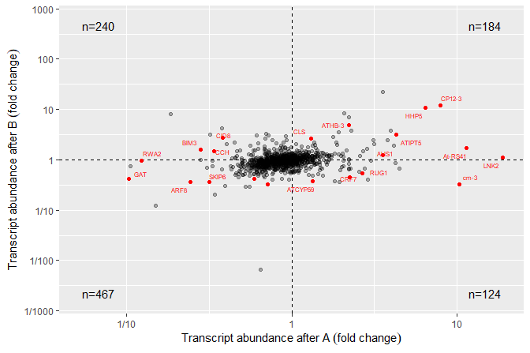

<!-- README.md is generated from README.Rmd. Please edit that file -->

# ggpmisc

[](https://cran.r-project.org/package=ggpmisc)

## Purpose

Package ‘**ggpmisc**’ (Miscellaneous Extensions to ‘ggplot2’) is a set
of extensions to R package ‘ggplot2’ (\>= 3.0.0) with emphasis on
annotations and highlighting related to fitted models and data
summaries. Data summaries shown as text, tables or equations are
implemented. New geoms support graphical insets. The location of fit
summaries and graphical insets within the plotting area needs usually to
be set independently of the `x` and `y` scales. The “natural”
coordinates to use in such cases are expressed in ‘grid’ “npc” units in
the range \[0..1\] for which new aesthetics and their scales are made
available.

## Geometries

Geometries `geom_table()`, `geom_plot()` and `geom_grob()` make it
possible to add inset tables, inset plots, and arbitrary ‘grid’
graphical objects as layers to a ggplot using native coordinates for `x`
and `y`. Geometries `geom_text_npc()`, `geom_label_npc()`,
`geom_table_npc()`, `geom_plot_npc()` and `geom_grob_npc()` are versions
that interpret `x` and `y` values as if expressed in “npc” units.

## Statistics

Statistic `stat_fmt_tb()` helps with the formatting of tabbles to be
plotted with `geom_table()`. Statistics `stat_peaks()` and
`stat_valleys()` can be used to highlight and/or label maxima and minima
in a plot. `ggplot` constructors for time series objects. The provided
`ggplot.ts()` and `ggplot.xts()` use `try_tibble()` which is also
exported and accepts objects of additional classes as input. Statistics
that help with reporting the resulst of model fits are `stat_poly_eq()`,
`stat_fit_residuals()`, `stat_fit_deviations()`, `stat_fit_broom()`,
`stat_fit_broom_tb()`. A summary statistic using special grouping for
quadrants `stat_quadrant_counts()` can be used to automate labelling
with the number of observations. `stat_apply_panel()` and
`stat_apply_group()` can be useful for applying arbitrary summary
functions. Two statistics, `stat_dens2d_filter()` and
`stat_dens2d_label()`, implement tagging or selective labelling of
observations based on the local 2D density of observations. These two
stats are designed to work well together with `geom_text_repel()` and
`geom_label_repel()` from package ‘ggrepel’.

## Aesthetics and scales

Scales `scale_npcx_continuous()` and `scale_npcy_continuous()` and the
corresponding new aesthetics `npcx` and `npcy` make it possible to add
graphic elements and text to plots using coordinates expressed in `npc`
units for the location within the plotting area, improving support for
annotations, most notably when using facets.

Scales `scale_x_logFC()` and `scale_y_logFC()` are suitable for plotting
of log fold change data, `scale_x_Pvalue()` and `scale_y_Pvalue()` for
*P*-values, and `scale_x_FDR()` and `scale_y_FDR()` for false discovery
rate. They are defined as wrappers on `scale_x_continuous()` and
`scale_y_continuous()` with overriden default arguments suitable for
volcano and quadrant plots as used for genomic data.

## ggplot methods

Being `ggplot()` defined as a generic method in ‘ggplot2’ makes it
possible to define specializations, and we provide two for time series
stored in objects of classes `ts` and `xts` which automatically convert
these objects into tibbles and set the as default the aesthetic mappings
for `x` and `y`. A companion fucntion `try_tibble()` is also exported.

## MIGRATED

Functions for the manipulation of layers in ggplot objects and
statistics and geometries that echo their data input to the R console,
earlier included in this package are now in package ‘gginnards’. [](https://cran.r-project.org/package=gginnards)

## Examples

``` r
library(ggpmisc)
```

In the first example we plot a time series using the specialized version
of `ggplot()` that converts the time series into a tibble and maps the
`x` and `y` aesthetics automatically. We also highlight and label the
peaks using `stat_peaks`.

``` r
ggplot(lynx, as.numeric = FALSE) + geom_line() + 
  stat_peaks(colour = "red") +
  stat_peaks(geom = "text", colour = "red", angle = 66,
             hjust = -0.1, x.label.fmt = "%Y") +
  stat_peaks(geom = "rug", colour = "red", sides = "b") +
  expand_limits(y = 8000)
#> Registered S3 method overwritten by 'xts':
#>   method     from
#>   as.zoo.xts zoo
```

<!-- -->

In the second example we add the equation for a fitted polynomial plus
the adjusted coefficient of determination to a plot showing the
observations plus the fitted curve, deviations and confidence band. We
use `stat_poly_eq()`.

``` r
formula <- y ~ x + I(x^2)
ggplot(cars, aes(speed, dist)) +
  geom_point() +
  stat_fit_deviations(method = "lm", formula = formula, colour = "red") +
  geom_smooth(method = "lm", formula = formula) +
  stat_poly_eq(aes(label =  paste(..eq.label.., ..adj.rr.label.., sep = "~~~~")),
               formula = formula, parse = TRUE)
```

<!-- -->

The same figure as in the second example but this time annotated with
the ANOVA table for the model fit. We use `stat_fit_tb()` which can be
used to add ANOVA or summary tables.

``` r
formula <- y ~ x + I(x^2)
ggplot(cars, aes(speed, dist)) +
  geom_point() +
  geom_smooth(method = "lm", formula = formula) +
  stat_fit_tb(method = "lm",
              method.args = list(formula = formula),
              tb.type = "fit.anova",
              tb.vars = c(Effect = "term", 
                          "df",
                          "M.S." = "meansq", 
                          "italic(F)" = "statistic", 
                          "italic(P)" = "p.value"),
               label.y.npc = "top", label.x.npc = "left",
              size = 2.5,
              parse = TRUE)
```

<!-- -->

A plot with an inset plot.

``` r
library(tibble)
p <- ggplot(mtcars, aes(factor(cyl), mpg, colour = factor(cyl))) +
  stat_boxplot() +
  labs(y = NULL) +
  theme_bw(9) + theme(legend.position = "none")
df <- tibble(x = 0.01, y = 0.015, plot = list(p))
ggplot(mtcars, aes(wt, mpg, colour = factor(cyl))) +
  geom_point() +
  geom_plot_npc(data = df, mapping = aes(npcx = x, npcy = y, label = plot),
                vjust = 0, hjust = 0) +
  expand_limits(y = 0, x = 0)
```

<!-- -->

A quadrant plot with counts.

``` r
set.seed(12346)
my.df <- data.frame(x = rnorm(50), y = rnorm(50))
ggplot(my.df, aes(x, y)) +
  geom_point() +
  geom_quadrant_lines() +
  stat_quadrant_counts() +
  expand_limits(x = c(-3, 3), y = c(-3, 3))
```

<!-- -->

## Installation

Installation of the most recent stable version from CRAN:

``` r
install.packages("ggpmisc")
```

Installation of the current unstable version from Bitbucket:

``` r
# install.packages("devtools")
devtools::install_bitbucket("aphalo/ggpmisc")
```

## Documentation

HTML documentation is available at
(<https://docs.r4photobiology.info/ggpmisc/>), including a *User Guide*.

News on updates to the different packages of the ‘r4photobiology’ suite
are regularly posted at (<https://www.r4photobiology.info/>).

## Contributing

Please report bugs and request new features at
(<https://bitbucket.org/aphalo/ggpmisc/issues>). Pull requests are
welcome at (<https://bitbucket.org/aphalo/ggpmisc>).

Please note that this project is released with a [Contributor Code of
Conduct](CONDUCT.md). By participating in this project you agree to
abide by its terms.

## Citation

If you use this package to produce scientific or commercial
publications, please cite according to:

``` r
citation("ggpmisc")
#> 
#> To cite package 'ggpmisc' in publications use:
#> 
#>   Pedro J. Aphalo (2019). ggpmisc: Miscellaneous Extensions to
#>   'ggplot2'. https://www.r4photobiology.info,
#>   https://bitbucket.org/aphalo/ggpmisc.
#> 
#> A BibTeX entry for LaTeX users is
#> 
#>   @Manual{,
#>     title = {ggpmisc: Miscellaneous Extensions to 'ggplot2'},
#>     author = {Pedro J. Aphalo},
#>     year = {2019},
#>     note = {https://www.r4photobiology.info, https://bitbucket.org/aphalo/ggpmisc},
#>   }
```

## License

© 2016-2019 Pedro J. Aphalo (<pedro.aphalo@helsinki.fi>). Released under
the GPL, version 2 or greater. This software carries no warranty of any
kind.
