## Preliminaries

We load all the packages used in the examples.


```r
library(ggpmisc)
library(ggrepel)
library(xts)
```

```
## Loading required package: zoo
```

```
## 
## Attaching package: 'zoo'
```

```
## The following objects are masked from 'package:base':
## 
##     as.Date, as.Date.numeric
```

```r
library(lubridate)
```

```
## 
## Attaching package: 'lubridate'
```

```
## The following object is masked from 'package:base':
## 
##     date
```

```r
library(tibble)
library(dplyr)
```

```
## 
## Attaching package: 'dplyr'
```

```
## The following objects are masked from 'package:lubridate':
## 
##     intersect, setdiff, union
```

```
## The following objects are masked from 'package:xts':
## 
##     first, last
```

```
## The following objects are masked from 'package:stats':
## 
##     filter, lag
```

```
## The following objects are masked from 'package:base':
## 
##     intersect, setdiff, setequal, union
```

```r
library(nlme)
```

```
## 
## Attaching package: 'nlme'
```

```
## The following object is masked from 'package:dplyr':
## 
##     collapse
```
As we will use text and labels on the plotting area we change the default theme
to an uncluttered one.


```r
old_theme <- theme_set(theme_bw())
```

## Introduction

Many of the functions, including ggplot _statistics_ and _geoms_, included in
package 'ggpmisc' had their origin in my need to produce plots for use in
teaching or research reports. Some of them are enerally useful, such as 
`stat_poly_eq()` and `stat_quadrant_counts()`but
others like `stat_fit_deviations()` are squarely aimed and producing learning
material. Function `try_tibble()` opens the door to easily
converting time series stored in objects of several different classes into data
frames. This is, for example, useful for plotting time series data with `ggplot()`.
New `ggplot()` method specializations for classes `ts` and `xts` make the call to
`try_tibble()` and conversion automatic.

## ggplot methods for time series

`ggplot()` methods for classes `"ts"` and `"xts"` automate plotting of time
series data, as _x_ and _y_ aesthetics are mapped to time and the variable of
the time series, respectively. For plotting time series data stored in objects of other classes,
see the conversion functions `try_tibble()` and `try_data_frame()` in the last
section of this vignette.


```r
class(lynx)
```

```
## [1] "ts"
```

```r
ggplot(lynx) + geom_line()
```

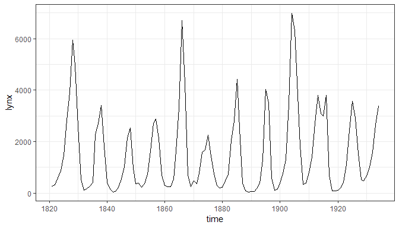

It is possible to control the conversion of the time variable to numeric or datetime. As we will see
below this affects the scale used by default as well as the formatting of values when converted
to character strings or printed.


```r
ggplot(lynx, as.numeric = FALSE) + geom_line()
```


## geom_table and stat_fmt_table

The _geometry_ `geom_table()` plots a data frame or tibble, nested in a tibble passed as data
argument, using _aesthetics_ `x` and `y` for positioning, and `label` for the
data frame containing the data for the table. The table is created as a 'grid'
grob and added as usual to the ggplot object. In contrast to "standard"
geoms, this geom by default does not inherit the globally mapped aesthetics.


```r
tb <- mpg %>%
  group_by(cyl) %>%
  summarise(hwy = median(hwy), cty = median(cty))
data.tb <- tibble(x = 7, y = 44, tb = list(tb))
ggplot(mpg, aes(displ, hwy, colour = factor(cyl))) +
  geom_table(data = data.tb, aes(x, y, label = tb)) +
  geom_point() 
```

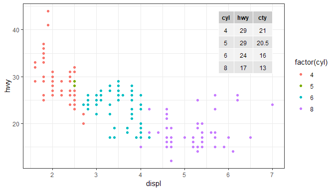

Using `stat_fmt_tb()` we can rename columns of the tibble,
and/or select a subset of columns or a slice of rows as shown below. To provide
a complete example we also replace the names of the _x_, _y_ and _colour_
aesthetics.


```r
ggplot(mpg, aes(displ, hwy, colour = factor(cyl))) +
  geom_table(data = data.tb, aes(x, y, label = tb),
             size = 3, colour = "dark blue",
             stat = "fmt_tb", tb.vars = c(Cylinders = "cyl", "MPG" = "hwy")) +
  labs(x = "Engine displacement (l)", y = "Fuel use efficiency (MPG)",
       colour = "Engine cylinders\n(number)") +
  geom_point() +
  theme_bw()
```

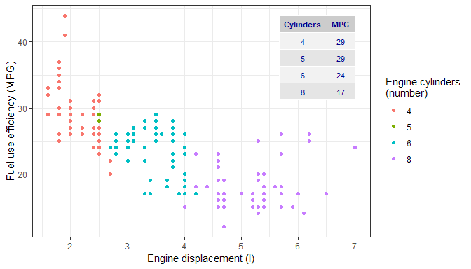


Parsed text, using plot math syntax is supported in the table, with fall-back to
plain text in case of parsing errors, on a cell by cell basis. Here we plot
the MPG for city traffic and we can see that the plotting area expands to include
the coordinates at which the table is anchored. Justification is by default set
to `"inward"` which ensures that the table is fully within the plotting
region.


```r
tb.pm <- tibble(Parameter = c("frac(beta[1], a^2)", "frac(beta[2], a^3)"),
                Value = c("10^2.4", "10^3.532"))
data.tb <- tibble(x = 7, y = 44, tb = list(tb.pm))
ggplot(mpg, aes(displ, cty)) +
  geom_point() +
  geom_table(data = data.tb, aes(x, y, label = tb), parse = TRUE) +
  theme_bw()
```

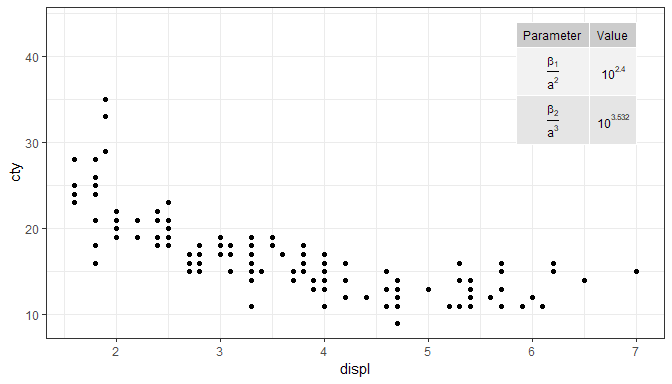

As implemented, there is no limitation to the number of insets, and faceting is
respected. If the base plot shows a map, multiple small tables could be
superimposed on different countries or regions. The size of the insets is set
relative to the main plot, so the combined plot can be scaled.

Please see section **Normalised Parent Coordinates** below for a description of
`geom_table_npc()`.

## geom_plot

The `geom_plot()` _geometry_ plots ggplot objects, nested in a tibble passed as data
argument, using _easthetics_ `x` and `y` for positioning, and `label` for the
ggplot object containing the definition of the plot to be nested. A Grob is 
created with 'ggplotGrob' and added as usual to the ggplot object.

As an example we produce plot where the inset plot is a zommed-in detail from
the main plot. In this case the main and inset plots start as the same plot.


```r
p <- ggplot(mpg, aes(displ, hwy, colour = factor(cyl))) +
  geom_point() 

data.tb <- tibble(x = 7, y = 44, 
                  plot = list(p + 
                                coord_cartesian(xlim = c(4.9, 6.2), ylim = c(13, 21)) +
                                labs(x = NULL, y = NULL) +
                                theme_bw(8) +
                                scale_colour_discrete(guide = FALSE)))

ggplot(mpg, aes(displ, hwy, colour = factor(cyl))) +
  geom_plot(data = data.tb, aes(x, y, label = plot)) +
  annotate(geom = "rect", 
           xmin = 4.9, xmax = 6.2, ymin = 13, ymax = 21,
           linetype = "dotted", fill = NA, colour = "black") +
  geom_point() 
```

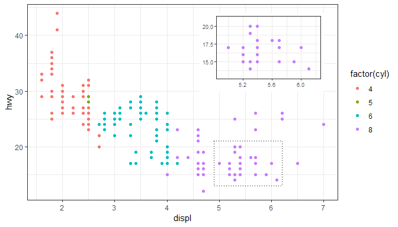
In general, the inset plot can be any ggplot object, allowing the creation of
very different combinations of main plot and inset plot. Here we use the inset
to summaries as in the previous example of an inset table.


```r
p <- ggplot(mpg, aes(factor(cyl), hwy, fill = factor(cyl))) +
  stat_summary(geom = "col", fun.y = mean, width = 2/3) +
  labs(x = "Number of cylinders", y = NULL, title = "Means") +
  scale_fill_discrete(guide = FALSE)

data.tb <- tibble(x = 7, y = 44, 
                  plot = list(p +
                                theme_bw(8)))

ggplot(mpg, aes(displ, hwy, colour = factor(cyl))) +
  geom_plot(data = data.tb, aes(x, y, label = plot)) +
  geom_point() +
  labs(x = "Engine displacement (l)", y = "Fuel use efficiency (MPG)",
       colour = "Engine cylinders\n(number)") +
  theme_bw()
```

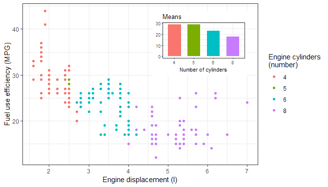

As implemented, there is no limitation to the number of insets, and faceting is
respected. If the base plot shows a map, multiple small plots could be
superimposed on different countries or regions. The size of the insets is set
relative to the main plot, so the combined plot can be scaled. A possible
unintuitive but useful feature, is that the theme is linked to each plot.

Please see section **Normalised Parent Coordinates** below for a description of
`geom_plot_npc()`.

## geom_grob

The `geom_grob()` _geometry_ plots grobs (graphical objects as created with
'grid'), nested in a tibble passed as data argument, using _easthetics_ `x` and
`y` for positioning, and `label` for the Grob object. While `geom_table()` and
`geom_plot()` take as values to plot tibbles or data frames, and ggplots,
respectively, and convert them into Grobs before adding them to the plot,
`geom_grob()` expects Grobs ready to be rendered.


```r
tiger <- magick::image_read('http://jeroen.github.io/images/tiger.svg')
grobs.tb <- tibble(x = c(0, 10, 20, 40), y = c(4, 6, 8, 9),
                   width = c(0.05, 0.05, 0.01, 0.25),
                   height =  c(0.05, 0.05, 0.01, 0.25),
                   grob = list(grid::circleGrob(), 
                               grid::rectGrob(), 
                               grid::textGrob("I am a Grob"),
                               grid::rasterGrob(image = tiger)))

ggplot() +
  geom_grob(data = grobs.tb, aes(x, y, label = grob, 
                                 vp.width = width, vp.height = height)) +
  scale_y_continuous(expand = expand_scale(mult = 0.3, add = 0)) +
  scale_x_continuous(expand = expand_scale(mult = 0.2, add = 0)) +
 theme_bw(12)
```

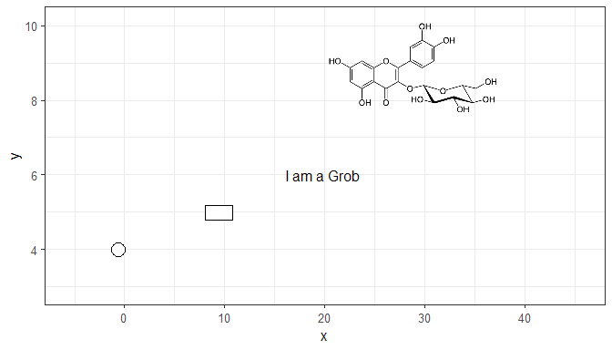
`geom_grob()` is designed thinking that its main use will in graphical annotations,
although one could use it for infographics with multiple copies of each grob, this
would go against the grammar of graphics. In this implementation grobs cannot
to mapped to an aesthetic through a scale.

As implemented, there is no limitation to the number of insets, and faceting is
respected. If the base plot shows a map, multiple simple grobs (e.g. national
flags) could be
superimposed on different countries. The size of the insets is set
relative to the main plot, so the combined plot can be scaled.

Please see next section for a description of
`geom_grob_npc()`.

## Normalised Parent Coordinates

R's 'grid' pakage defines several units that can be used to describe the locations
of plot elements. In 'ggplot2' the _x_ and _y_ aesthetics are directly mapped
to `"native"` or data units. For consistent location of **annotations** with
respect to the plotting area we need to rely on `"npc"` which are expressed
relative to the size of the grid viewport, as the plotting area in a ggplot
if implemented as viewport.

To support this we have implemented _scales_ for two new _aesthetics_, `npcx`
and `npcy`. These are very simple continuous scales which do not support any
transformation or change to their limits, which are meaningless for `"npc"`
units. Variables mapped to these aesthetics can be either numerical with
values in the range zero to one or
character. A limited set of strings are recognised and converted to "npc" units:
`"top"`, `"bottom"`, `"left"`, `"right"` and `"centre"` (or its synonims 
`"center"` and `"middle"`). Justification defaults to "inward".

To make these scales useful we need also to define _geometries_ that use these
new aesthetics. Package 'ggpmisc' currently provides `geom_text_npc()`,
`geom_label_npc()`, `geom_table_npc()`, `geom_plot_npc()` and `geom_grob_npc()`.

These are used internally by several of the statistics described below. They 
can also be useful on their own right in those cases when we want to
add annotations at specific positions within the plotting area, while the
usual _x_ and _y_ aesthetics should be used whenever the positions of plot
elements represent data values. When writing scripts or functions that may
be applied to different data sets they help in keeping the code consise and
reusable.

As an example let's imagine that we want to add an intitutional logo to a plot. 
Its position has nothing to
do with the data mapped to _x_ and _y_, so it is conceptually better to use
`"npc"` coordinates. The big practical advantage is that this also allows to
keep this part of the plot definition independent of the data being plotted,
giving a major advantage in the case of plots with facets with free scale
limits.

We assume here that the tiger is being used as a logo, and we simply map
all aesthetics to constant values.


```r
tiger <- magick::image_read('http://jeroen.github.io/images/tiger.svg')
data.tb <- tibble(x = 1:20, y = (1:20) + rnorm(20, 0, 10))

ggplot(data.tb, aes(x, y)) +
  geom_grob_npc(label = list(grid::rasterGrob(image = tiger)), 
                npcx = 0, npcy = 0.95) +
  geom_point() +
  expand_limits(y = 45, x = 0)
```

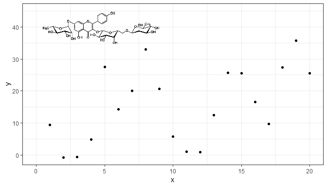

Alternatively we produce the same plot by creating a data frame to contain the
grob and the coordinates, and then map these variable to the aesthetics using
`aes()`.

```r
logo.tb <- tibble(x = 0,
                  y = 0.95,
                  grob = list(grid::rasterGrob(image = tiger)))

ggplot(data.tb, aes(x, y)) +
  geom_grob_npc(data = logo.tb, aes(label = grob, npcx = x, npcy = y)) +
  geom_point() +
  expand_limits(y = 45, x = 0)
```

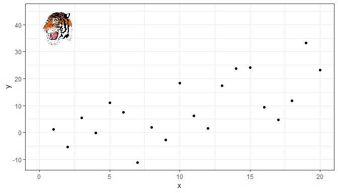

Two geometries are based on existing 'ggplot2' geometries. They are almost like
wrappers built on top of `geom_text()` and `geom_label()`. We give an example
using `geom_text_npc()` to produce a "classic" labelling for facets matching 
the style of `theme_classic()` and traditional sicentific journals' design.


```r
corner_letters.tb <- tibble(label = LETTERS[1:4],
                            x = "left", 
                            y = "top",
                            cyl = c(4,5,6,8))
ggplot(mpg, aes(displ, hwy)) +
  geom_point() +
  facet_wrap(~cyl, scales = "free") +
  geom_text_npc(data = corner_letters.tb,
                aes(npcx = x, npcy = y, label = label)) +
  theme_classic() +
  theme(strip.background = element_blank(),
        strip.text.x = element_blank())
```

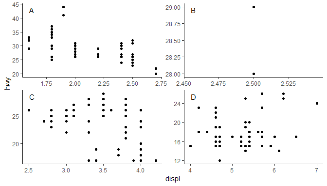

## stat_peaks and stat_valleys

Two statistics make it possible to highlight and/or label peaks and valleys (local maxima
and local minima) in a curve. Here we use a time series, using POSIXct for `time` 
and the default formatting of labels. We also instruct `geom_text()` not to
render overlapping labels.


```r
ggplot(lynx, as.numeric = FALSE) + geom_line() + 
  stat_peaks(colour = "red") +
  stat_peaks(geom = "text", colour = "red", vjust = -0.5, 
             check_overlap = TRUE) +
  ylim(-100, 7300)
```

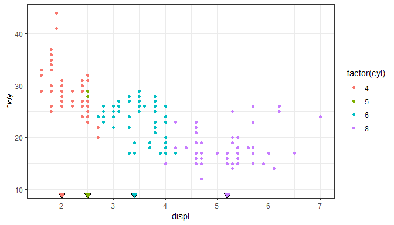

Using numeric values for `time` and the default formatting of labels. We can
also pass other aesthetics recognised the `geom_text()` such as `angle`. Here
we also highlight and label the valleys.


```r
ggplot(lynx) + geom_line() + 
  stat_peaks(colour = "red") +
  stat_peaks(geom = "text", colour = "red", hjust = -0.2, vjust = 0.5, 
             angle = 90, check_overlap = TRUE) +
  stat_valleys(colour = "blue") +
  stat_valleys(geom = "text", colour = "blue", hjust = 1.2, vjust = 0.5, 
             angle = 90, check_overlap = TRUE) +
  expand_limits(y = c(-900, 8000))
```

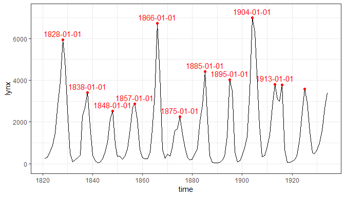

Using POSIXct for `time` but supplying a format string. In addition marking both
peaks and valleys.


```r
ggplot(lynx, as.numeric = FALSE) + geom_line() + 
  stat_peaks(colour = "red") +
  stat_peaks(geom = "text", colour = "red", hjust = -0.2, vjust = 0.5, 
             angle = 90, check_overlap = TRUE, x.label.fmt = "%Y") +
  stat_valleys(colour = "blue") +
  stat_valleys(geom = "text", colour = "blue", hjust = 1.2, vjust = 0.5, 
             angle = 90, check_overlap = TRUE, x.label.fmt = "%Y") +
  expand_limits(y = c(-900, 8000))
```


Using `geom_rug` for the peaks and valleys.


```r
ggplot(lynx, as.numeric = FALSE) + geom_line() + 
  stat_peaks(colour = "red") +
  stat_peaks(geom = "rug", colour = "red") +
  stat_valleys(colour = "blue") +
  stat_valleys(geom = "rug", colour = "blue")
```

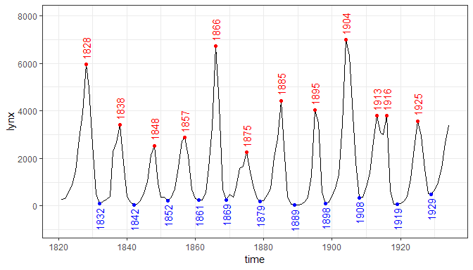

## stat_quadrant_counts

This statistic automates the annotation of plots with number of observations,
either by quadrant, by pairs of quadrants or the four quadrants taken together
(whole plotting area).

We generate some artificial data.


```r
set.seed(4321)
# generate artificial data
x <- -99:100
y <- x + rnorm(length(x), mean = 0, sd = abs(x))
my.data <- data.frame(x, 
                      y, 
                      group = c("A", "B"))
```

Using defaults except for colour.


```r
ggplot(my.data, aes(x, y)) +
  geom_hline(yintercept = 0, colour = "red") +
  geom_vline(xintercept = 0, colour = "red") +
  geom_point() +
  expand_limits(y = c(-220, 220)) +
  stat_quadrant_counts(colour = "red")
```


Pooling quadrants along the _x_-axis. (`pool.along = "y"` pools along _y_.)


```r
ggplot(my.data, aes(x, y)) +
  geom_hline(yintercept = 0, colour = "red") +
  geom_point() +
  stat_quadrant_counts(colour = "red", pool.along = "x")
```

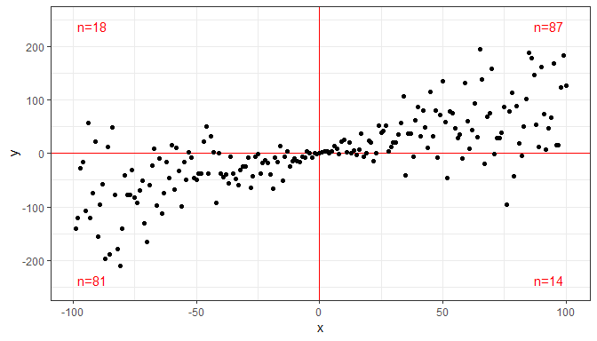

Manual positioning of the text annotations and pooling of all four quadrants,
and overriding the default formatting for the label.


```r
ggplot(my.data, aes(x, y)) +
  geom_point() +
  stat_quadrant_counts(quadrants = 0L, label.x = "left", 
                       aes(label = sprintf("%i observations", stat(count))))
```

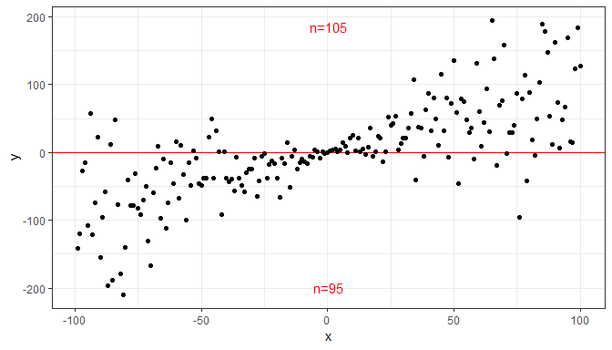

Annotation of only specific quadrants.


```r
ggplot(my.data, aes(x, y)) +
  geom_hline(yintercept = 0, colour = "red") +
  geom_vline(xintercept = 0, colour = "red") +
  geom_point() +
  stat_quadrant_counts(colour = "red", quadrants = c(2, 4))
```

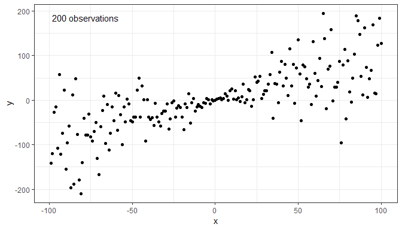
Using facets, even with free scale limits, the labels are placed consistently. This achieved
by the default use of `geom_text_npc()` or as shown below by use of `geom_label_npc(). We
expand the _y_ limits to ensure that no observations are ocluded by the labels.


```r
ggplot(my.data, aes(x, y, colour = group)) +
  geom_hline(yintercept = 0) +
  geom_vline(xintercept = 0) +
  geom_point() +
  stat_quadrant_counts(hjust = "inward", geom = "label_npc") +
  expand_limits(y = c(-260, 260)) +
  facet_wrap(~group)
```

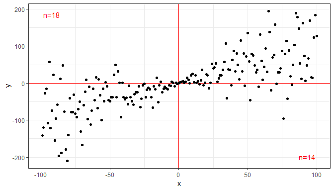

## stat_poly_eq

We generate another set of artificial data.


```r
set.seed(4321)
# generate artificial data
x <- 1:100
y <- (x + x^2 + x^3) + rnorm(length(x), mean = 0, sd = mean(x^3) / 4)
my.data <- data.frame(x, 
                      y, 
                      group = c("A", "B"), 
                      y2 = y * c(0.5,2),
                      block = c("a", "a", "b", "b"),
                      wt = sqrt(x))
```

First one example using defaults. To ensure that the formula used in both
stats is the same, we first save it to a variable.


```r
formula <- y ~ poly(x, 3, raw = TRUE)
ggplot(my.data, aes(x, y)) +
  geom_point() +
  stat_smooth(method = "lm", formula = formula) +
  stat_poly_eq(formula = formula, parse = TRUE)
```


`stat_poly_eq()` makes available three different labels in the returned data
frame. One of these is used by default, but `aes()` can be used to map a
different one to the `label` aesthetic. Here we show the adjusted coefficient
of determination and the two information criteria.


```r
formula <- y ~ poly(x, 3, raw = TRUE)
ggplot(my.data, aes(x, y)) +
  geom_point() +
  geom_smooth(method = "lm", formula = formula) +
  stat_poly_eq(aes(label = ..adj.rr.label..), formula = formula, 
               parse = TRUE) +
  stat_poly_eq(aes(label = ..AIC.label..),
               label.x = "right", label.y = "bottom", size = 3,     
               formula = formula, 
               parse = TRUE)
```

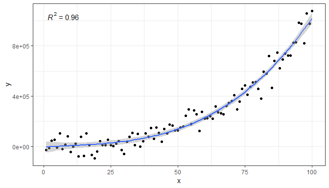

A ready formatted equation is also returned as a string that needs to be parsed into an _experession_ for display.


```r
formula <- y ~ poly(x, 3, raw = TRUE)
ggplot(my.data, aes(x, y)) +
  geom_point() +
  geom_smooth(method = "lm", formula = formula) +
  stat_poly_eq(aes(label = ..eq.label..), formula = formula, 
               parse = TRUE)
```

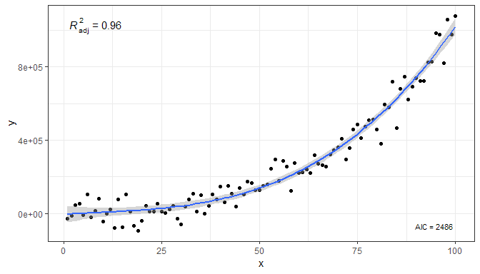

Within `aes()` it is possible to _compute_ new labels based on those returned
plus "arbitrary" text. The supplied labels are meant to be _parsed_ into
expressions, so any text added should be valid for a string that will be parsed.


```r
formula <- y ~ poly(x, 3, raw = TRUE)
ggplot(my.data, aes(x, y)) +
  geom_point() +
  geom_smooth(method = "lm", formula = formula) +
  stat_poly_eq(aes(label =  paste(..eq.label.., ..adj.rr.label.., sep = "~~~~~~")),
               formula = formula, parse = TRUE)
```

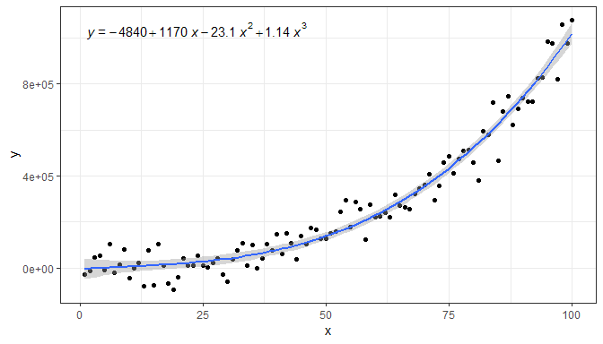

Above we inserted spaces between the labels, but it is possible to add also
other characters, even character strings. In this example we use several labels
instead of just two, and separate them with comma followed by a space. Do note
the need to _escape_ the embedded quotation marks and to use `plotmath` trickery
to add the comma at the end of the equation. We also change the size of the 
text in the label.


```r
formula <- y ~ poly(x, 3, raw = TRUE)
ggplot(my.data, aes(x, y)) +
  geom_point() +
  geom_smooth(method = "lm", formula = formula) +
  stat_poly_eq(aes(label =  paste(..eq.label.., ..rr.label.., 
                                  ..AIC.label.., ..BIC.label..,
                                  sep = "*\",\"~~")),
               formula = formula, parse = TRUE, size = 3.5)
```

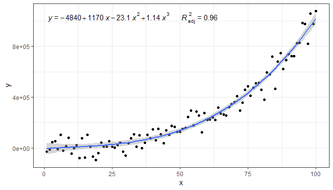

It is also possible to insert arbitrary text, and format it, using `plain()`, `italic()`, `bold()` or `bolditalic()` as described in `plotmath`.


```r
formula <- y ~ poly(x, 3, raw = TRUE)
ggplot(my.data, aes(x, y)) +
  geom_point() +
  geom_smooth(method = "lm", formula = formula) +
  stat_poly_eq(aes(label =  paste(..eq.label.., ..adj.rr.label.., 
                                  sep = "~~italic(\"with\")~~")),
               formula = formula, parse = TRUE)
```

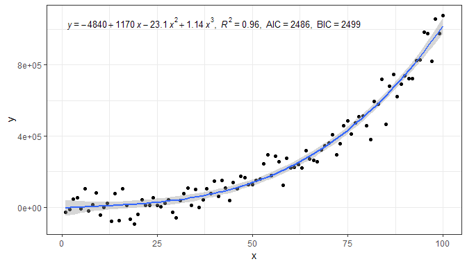

As these are expressions, to include two lines of text, we need eithe to add
`stat_poly_eq()` twice, passing an argument to `label.y` to reposition one of
the labels (not shown) or use (as shown) `atop()` within the experssion to
create a single label with two lines of text.


```r
formula <- y ~ poly(x, 3, raw = TRUE)
ggplot(my.data, aes(x, y)) +
  geom_point() +
  geom_smooth(method = "lm", formula = formula) +
  stat_poly_eq(aes(label = paste("atop(", ..AIC.label.., ",", ..BIC.label.., ")", sep = "")), 
               formula = formula, 
               parse = TRUE)
```


One example removing the left hand side (_lhs_).


```r
formula <- y ~ poly(x, 3, raw = TRUE)
ggplot(my.data, aes(x, y)) +
  geom_point() +
  geom_smooth(method = "lm", formula = formula) +
  stat_poly_eq(aes(label = ..eq.label..),
               eq.with.lhs = FALSE,
               formula = formula, parse = TRUE)
```

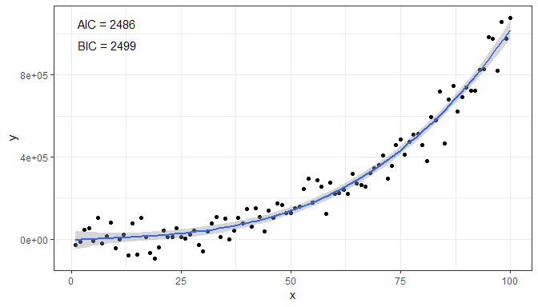

Replacing the _lhs_.


```r
formula <- y ~ poly(x, 3, raw = TRUE)
ggplot(my.data, aes(x, y)) +
  geom_point() +
  geom_smooth(method = "lm", formula = formula) +
  stat_poly_eq(aes(label = ..eq.label..),
               eq.with.lhs = "italic(hat(y))~`=`~",
               formula = formula, parse = TRUE)
```

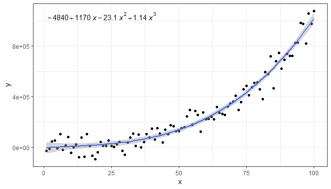
And a final explample to replaced _lhs_ and the variable symbol on the _rhs_.


```r
formula <- y ~ poly(x, 3, raw = TRUE)
ggplot(my.data, aes(x, y)) +
  geom_point() +
  geom_smooth(method = "lm", formula = formula) +
  labs(x = expression(italic(z)), y = expression(italic(h)) ) + 
  stat_poly_eq(aes(label = ..eq.label..),
               eq.with.lhs = "italic(h)~`=`~",
               eq.x.rhs = "~italic(z)",
               formula = formula, parse = TRUE)
```


As any valid R expression can be used, Greek letters are also supported, as well
as the inclusion in the label of variable transformations used in the model
formula.


```r
formula <- y ~ poly(x, 2, raw = TRUE)
ggplot(my.data, aes(x, log10(y + 1e6))) +
  geom_point() +
  geom_smooth(method = "lm", formula = formula) +
  stat_poly_eq(aes(label = ..eq.label..),
               eq.with.lhs = "plain(log)[10](italic(y)+10^6)~`=`~",
               formula = formula, parse = TRUE)
```

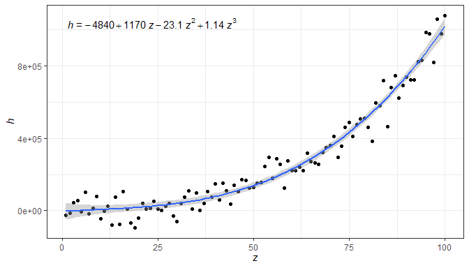

A couple of additional examples of polynomials of different orders, and
specified in different ways.

Higher order polynomial.


```r
formula <- y ~ poly(x, 5, raw = TRUE)
ggplot(my.data, aes(x, y)) +
  geom_point() +
  geom_smooth(method = "lm", formula = formula) +
  stat_poly_eq(aes(label = ..eq.label..), formula = formula, parse = TRUE)
```

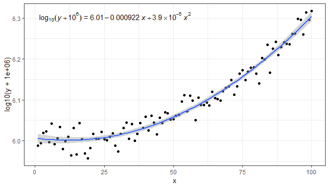

Intercept forced to zero.


```r
formula <- y ~ x + I(x^2) + I(x^3) - 1
ggplot(my.data, aes(x, y)) +
  geom_point() +
  geom_smooth(method = "lm", formula = formula) +
  stat_poly_eq(aes(label = ..eq.label..), formula = formula, 
               parse = TRUE)
```

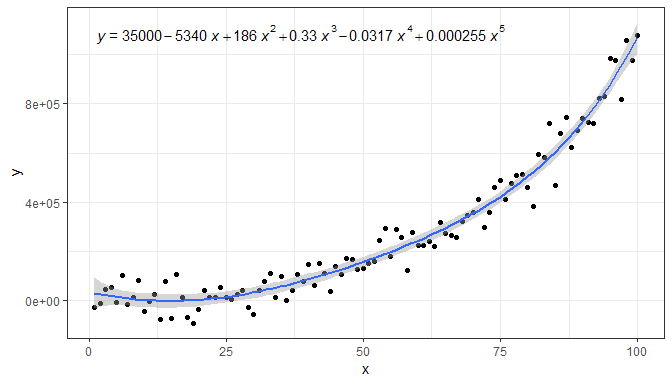

We give below several examples to demonstrate how other components of the
`ggplot` object affect the behaviour of this statistic.

Facets work as expected either with fixed or free scales. Although below we had
to adjust the size of the font used for the equation.


```r
formula <- y ~ poly(x, 3, raw = TRUE)
ggplot(my.data, aes(x, y2)) +
  geom_point() +
  geom_smooth(method = "lm", formula = formula) +
  stat_poly_eq(aes(label = ..eq.label..), size = 3,
               formula = formula, parse = TRUE) +
  facet_wrap(~group)
```

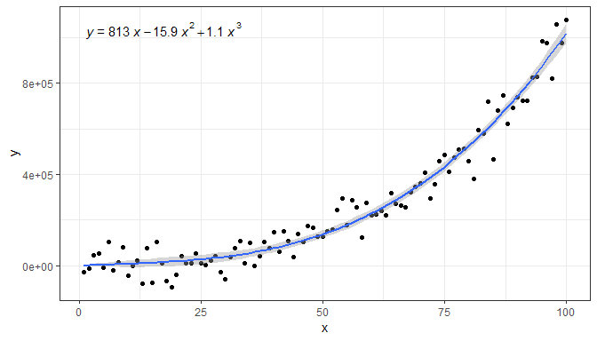


```r
formula <- y ~ poly(x, 3, raw = TRUE)
ggplot(my.data, aes(x, y2)) +
  geom_point() +
  geom_smooth(method = "lm", formula = formula) +
  stat_poly_eq(aes(label = ..eq.label..), size = 3,
               formula = formula, parse = TRUE) +
  facet_wrap(~group, scales = "free_y")
```

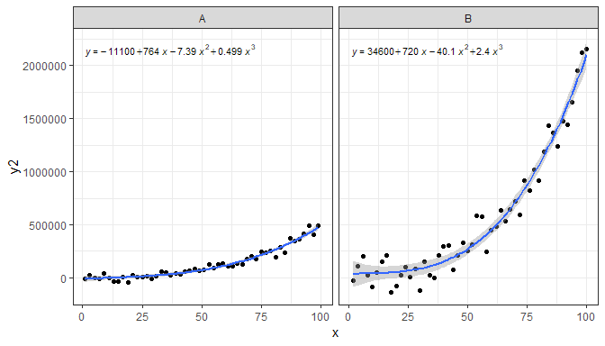

Grouping, in this example using the colour aesthetic also works as expected. We
can use justification and supply an absolute location for the equation, but the
default frequently works well as in the example below.


```r
formula <- y ~ poly(x, 3, raw = TRUE)
ggplot(my.data, aes(x, y2, colour = group)) +
  geom_point() +
  geom_smooth(method = "lm", formula = formula) +
  stat_poly_eq(aes(label = ..eq.label..),
               formula = formula, parse = TRUE)
```

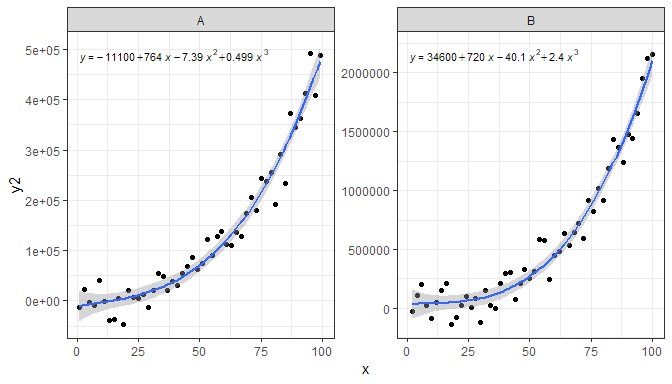

Label positions relative to the ranges of the _x_ and _y_ scales are also
supported, both through string constants and numeric values in the range
0 to 1, when using the default `geom_text_npc()`.


```r
formula <- y ~ poly(x, 3, raw = TRUE)
ggplot(my.data, aes(x, y2, colour = group)) +
  geom_point() +
  geom_smooth(method = "lm", formula = formula) +
  stat_poly_eq(aes(label = ..eq.label..),
               formula = formula, parse = TRUE,
               label.x = "centre")
```

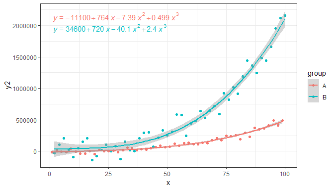

The default locations are now based on normalized coordinates, and consequently
these defaults work even when the range of the _x_ and _y_ scales varies from
panel to panel.


```r
formula <- y ~ poly(x, 3, raw = TRUE)
ggplot(my.data, aes(x, y2, fill = block)) +
  geom_point(shape = 21, size = 3) +
  geom_smooth(method = "lm", formula = formula) +
  stat_poly_eq(aes(label = ..rr.label..), size = 3,
               geom = "label_npc", alpha = 0.33,
               formula = formula, parse = TRUE) +
  facet_wrap(~group, scales = "free_y")
```

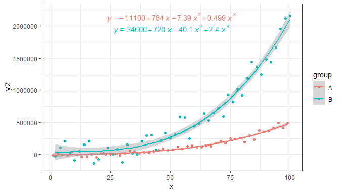
At the moment if the same variable used for faceting is also mapped to an
aesthetic the automatic location of labels results in "odd" alignment. **This is
bug that needs fixing.**


```r
formula <- y ~ poly(x, 3, raw = TRUE)
ggplot(my.data, aes(x, y2, colour = group, fill = block)) +
  geom_point(shape = 21, size = 3) +
  geom_smooth(method = "lm", formula = formula) +
  stat_poly_eq(aes(label = ..rr.label..), size = 3,
               geom = "label_npc", alpha = 0.2,
               formula = formula, parse = TRUE) +
  facet_wrap(~group, scales = "free_y")
```

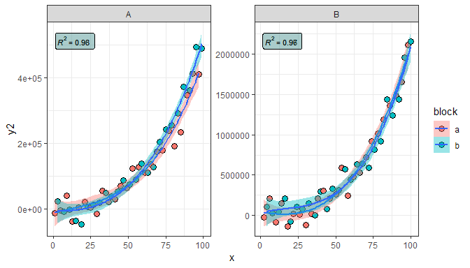

It is possible to use `geom_text()` and `geom_label()` but in this case label
coordinates need to be given explicitly in native data coordinates. When
multiple labels need to be positioned a vector of coordinates can be used as
shown here for `label.y`.


```r
formula <- y ~ poly(x, 3, raw = TRUE)
ggplot(my.data, aes(x, y2, colour = group)) +
  geom_point() +
  geom_smooth(method = "lm", formula = formula) +
  stat_poly_eq(geom = "text", aes(label = ..eq.label..),
               label.x = 0, label.y = c(1e6, 1.2e6), hjust = 0,
               formula = formula, parse = TRUE)
```

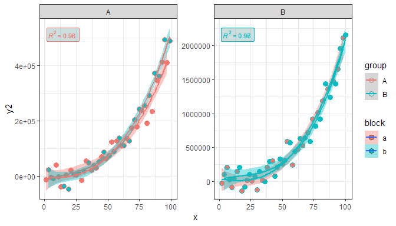

## stat_fit_residuals

I had the need to quickly plot residuals matching fits plotted with `geom_smooth()`
using grouping and facets, so a new (simple) statistic was born.


```r
formula <- y ~ poly(x, 3, raw = TRUE)
ggplot(my.data, aes(x, y, color = group)) +
  geom_hline(yintercept = 0, linetype = "dashed") +
  stat_fit_residuals(formula = formula)
```

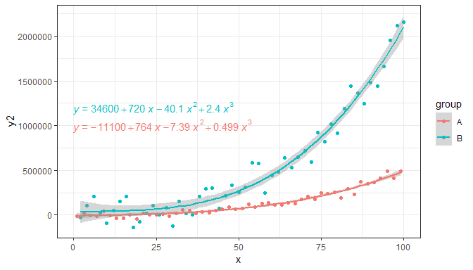

## stat_fit_deviations

As I also had the need to highlight residuals in slides and notes to be used in
teaching, another statistic was born.


```r
formula <- y ~ poly(x, 3, raw = TRUE)
ggplot(my.data, aes(x, y)) +
  geom_smooth(method = "lm", formula = formula) +
  stat_fit_deviations(formula = formula, color = "red") +
  geom_point()
```

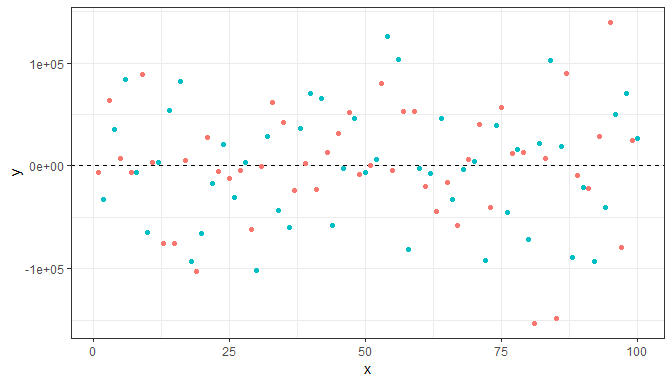
The geometry used by default is `geom_segment()` to which additional aesthetics
can be mapped. Here we add arrowheads.


```r
formula <- y ~ poly(x, 3, raw = TRUE)
ggplot(my.data, aes(x, y)) +
  geom_smooth(method = "lm", formula = formula) +
  geom_point() +
  stat_fit_deviations(formula = formula, color = "red",
                      arrow = arrow(length = unit(0.015, "npc"), 
                                   ends = "both"))
```

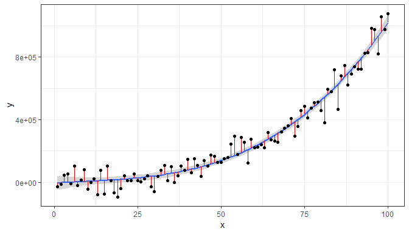

## stat_fit_glance

Package 'broom' provides consistently formated output from different model fitting
functions. These makes possible to write model-annotation statistic that are 
very flexible put that require more effort with the definition of the character
strings to map to the `label` aesthetic.

As we have above given some simple examples, we here exemplify this statistic
in a plot with grouping, and assemble a label for the _P_-value using a string
parsed into a expression. We also change the default position of the labels. 


```r
# formula <- y ~ poly(x, 3, raw = TRUE)
# broom::augment does not handle poly() correctly!
formula <- y ~ x + I(x^2) + I(x^3)
ggplot(my.data, aes(x, y, color = group)) +
  geom_point() +
  geom_smooth(method = "lm", formula = formula) +
  stat_fit_glance(method = "lm", 
                  method.args = list(formula = formula),
                  label.x = "right",
                  label.y = "bottom",
                  aes(label = paste("italic(P)*\"-value = \"*", 
                                    signif(..p.value.., digits = 4), sep = "")),
                  parse = TRUE)
```

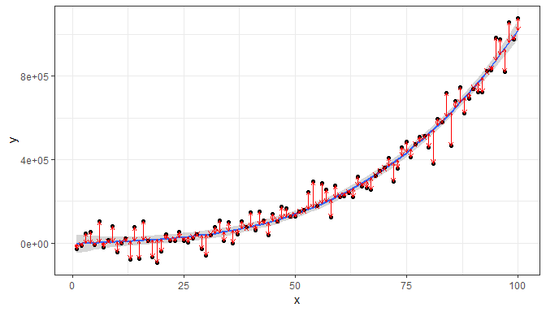

It is also possible to fit a non-linear model with `method = "nls"`, and any
other model for which a `glance()` method exists. Do consult the documentation 
for package 'broom'. Here we fit the Michaelis-Menten equation to reaction
rate versus concentration data.


```r
micmen.formula <- y ~ SSmicmen(x, Vm, K) 
ggplot(Puromycin, aes(conc, rate, colour = state)) +
  geom_point() +
  geom_smooth(method = "nls", 
              formula = micmen.formula,
              se = FALSE) +
  stat_fit_glance(method = "nls", 
                  method.args = list(formula = micmen.formula),
                  aes(label = paste("AIC = ", signif(..AIC.., digits = 3), 
                                    ", BIC = ", signif(..BIC.., digits = 3),
                                    sep = "")),
                  label.x = "centre", label.y = "bottom")
```

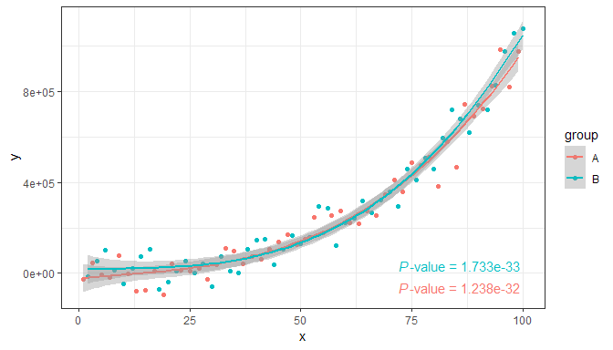

## stat_fit_tidy

This stat makes it possible to add the equation for any fitted model for which
`broom::tidy()` is implemented. Alternatively, individual values such as
estimates for the fitted parameters, standard errors, or _P_-values can be added
to a plot. However, the user has to explicitly construct the labels within
`aes()`. This statistic respects grouping based on aesthetics, and reshapes the
output of `tidy()` so that the values for a given group are in a single row in
the returned `data`.


```r
micmen.formula <- y ~ SSmicmen(x, Vm, K) 
ggplot(Puromycin, aes(conc, rate, colour = state)) +
  geom_point() +
  geom_smooth(method = "nls", 
              formula = micmen.formula,
              se = FALSE) +
  stat_fit_tidy(method = "nls", 
                method.args = list(formula = micmen.formula),
                label.x = "right",
                label.y = "bottom",
                aes(label = paste("V[m]~`=`~", signif(..Vm_estimate.., digits = 3),
                                  "%+-%", signif(..Vm_se.., digits = 2),
                                  "~~~~K~`=`~", signif(..K_estimate.., digits = 3),
                                  "%+-%", signif(..K_se.., digits = 2),
                                  sep = "")),
                parse = TRUE)
```

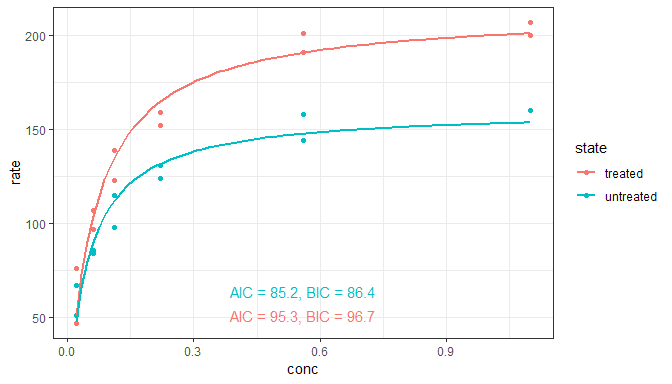


```r
micmen.formula <- y ~ SSmicmen(x, Vm, K) 
ggplot(Puromycin, aes(conc, rate, colour = state)) +
  geom_point() +
  geom_smooth(method = "nls", 
              formula = micmen.formula,
              se = FALSE) +
  stat_fit_tidy(method = "nls", 
                method.args = list(formula = micmen.formula),
                size = 3,
                label.x = "center",
                label.y = "bottom",
                vstep = 0.18,
                aes(label = paste("V~`=`~frac(", signif(..Vm_estimate.., digits = 2), "~C,",
                                  signif(..K_estimate.., digits = 2), "+C)",
                                  sep = "")),
                parse = TRUE) +
  labs(x = "C", y = "V")
```

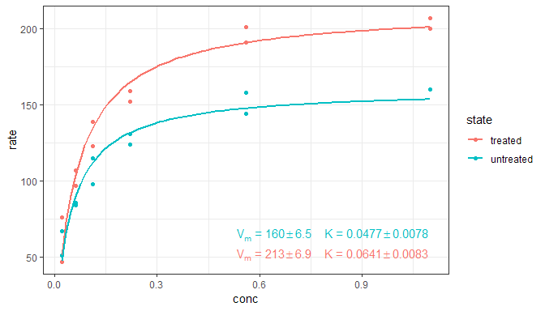

## stat_fit_tb

This stat makes it possible to add summary or ANOVA tables for any fitted model
for which `broom::tidy()` is implemented. The output from `tidy()` is embedded
as a single list value within the returned `data`, an object of class `tibble`.
This statistic **ignores grouping** based on aesthetics. This allows fitting
models when `x` or `y` is a factor (as in such cases `ggplot` splits the data
into groups, one for each level of the factor, which is needed for example for
`stat_summary()` to work as expected). By default, the `"table"` geometry is
used. The use of `geom_table()` is described in a separate section of this User
Guide.

The default output of `stat_fit_tb` is the default output from `tidy(mf)` where
`mf` is the fitted model.


```r
formula <- y ~ x + I(x^2) + I(x^3)
ggplot(my.data, aes(x, y)) +
  geom_point() +
  geom_smooth(method = "lm", formula = formula) +
  stat_fit_tb(method = "lm",
              method.args = list(formula = formula),
              tb.vars = c(Parameter = "term", 
                          Estimate = "estimate", 
                          "s.e." = "std.error", 
                          "italic(t)" = "statistic", 
                          "italic(P)" = "p.value"),
              label.y = "top", label.x = "left",
              parse = TRUE)
```

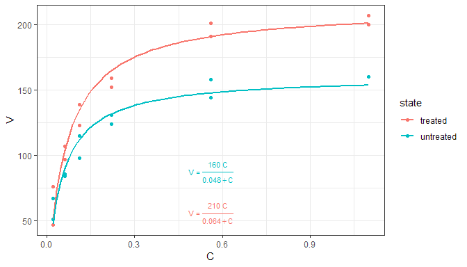

When `tb.type = "fit.anova"` the output returned is that from `tidy(anova(mf))`
where `mf` is the fitted model.


```r
formula <- y ~ x + I(x^2) + I(x^3)
ggplot(my.data, aes(x, y)) +
  geom_point() +
  geom_smooth(method = "lm", formula = formula) +
  stat_fit_tb(method = "lm",
              method.args = list(formula = formula),
              tb.type = "fit.anova",
              tb.vars = c(Effect = "term", 
                          "df",
                          "M.S." = "meansq", 
                          "italic(F)" = "statistic", 
                          "italic(P)" = "p.value"),
               label.y = "top", label.x = "left",
              parse = TRUE)
```

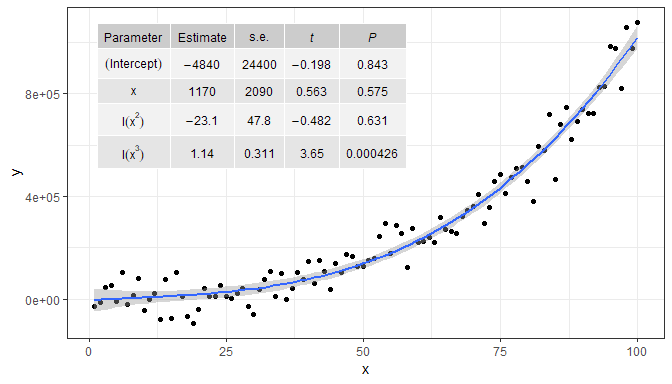

When `tb.type = "fit.coefs"` the output returned is that of `tidy(mf)` after
selecting the `term` and `estimate` columns.


```r
formula <- y ~ x + I(x^2) + I(x^3)
ggplot(my.data, aes(x, y)) +
  geom_point() +
  geom_smooth(method = "lm", formula = formula) +
  stat_fit_tb(method = "lm",
              method.args = list(formula = formula),
              tb.type = "fit.coefs",
              label.y = "center", label.x = "left")
```

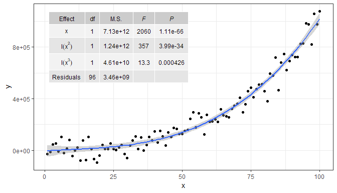

Faceting works as expected, but grouping is ignored as mentioned above. In this
case, the colour aesthetic is not applied to the text of the tables.
Furthermore, if `label.x.npc` or `label.y.npc` are passed numeric vectors of
length > 1, the values are obeyed by the different panels.


```r
micmen.formula <- y ~ SSmicmen(x, Vm, K)
ggplot(Puromycin, aes(conc, rate, colour = state)) +
  facet_wrap(~state) +
  geom_point() +
  geom_smooth(method = "nls",
              formula = micmen.formula,
              se = FALSE) +
  stat_fit_tb(method = "nls",
              method.args = list(formula = micmen.formula),
              tb.type = "fit.coefs",
              label.x = 0.9,
              label.y = c(0.75, 0.2)) +
  theme(legend.position = "none") +
  labs(x = "C", y = "V")
```

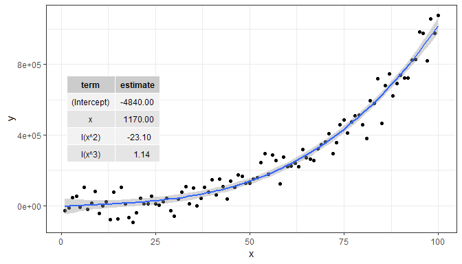

The data in the example below are split by `ggplot` into six groups based on the
levels of the `feed` factor. However, as `stat_fit_tb()` ignores groupings, we
can still fit a linear model to all the data in the panel.


```r
ggplot(chickwts, aes(factor(feed), weight)) +
  stat_summary(fun.data = "mean_se") +
  stat_fit_tb(tb.type = "fit.anova",
              label.x = "center",
              label.y = "bottom") +
  expand_limits(y = 0)
```

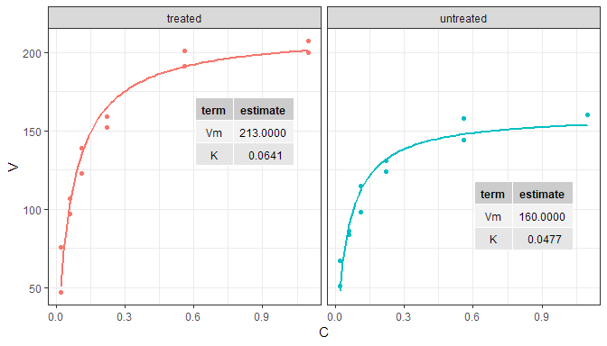

We can flip the system of coordinates, if desired.


```r
ggplot(chickwts, aes(factor(feed), weight)) +
  stat_summary(fun.data = "mean_se") +
  stat_fit_tb(tb.type = "fit.anova", label.x = "left", size = 3) +
  scale_x_discrete(expand = expand_scale(mult = c(0.2, 0.5))) +
  coord_flip()
```

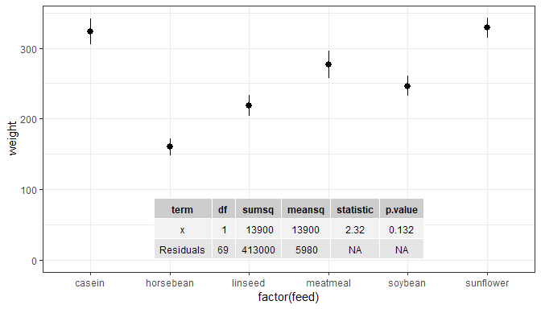

It is also possible to rotate the table using `angle`.


```r
ggplot(chickwts, aes(factor(feed), weight)) +
  stat_summary(fun.data = "mean_se") +
  stat_fit_tb(tb.type = "fit.anova",
              angle = 90, size = 3,
              label.x = "right", label.y = "center",
              hjust = 0.5, vjust = 0,
              tb.vars = c(Effect = "term", 
                          "df",
                          "M.S." = "meansq", 
                          "italic(F)" = "statistic", 
                          "italic(P)" = "p.value"),
              parse = TRUE) +
  scale_x_discrete(expand = expand_scale(mult = c(0.1, 0.35))) +
  expand_limits(y = 0)
```

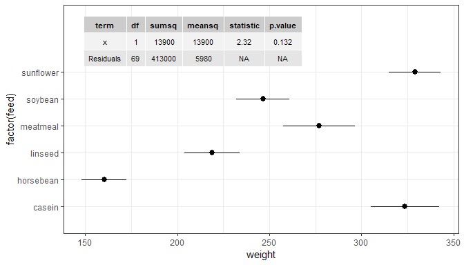

## stat_fit_augment

**Experimental!** 
Use `ggplot2::stat_smooth` instead of `stat_fit_augment` if possible.

For a single panel and no grouping, there is little advantage in using this
statistic compared to the examples in the documentation of package 'broom'. With
grouping and faceting `stat_fit_augment` may occasionally be more convenient
than `ggplot2::stat_smooth` because of its flexibility.


```r
# formula <- y ~ poly(x, 3, raw = TRUE)
# broom::augment does not handle poly correctly!
formula <- y ~ x + I(x^2) + I(x^3)
ggplot(my.data, aes(x, y)) +
  geom_point() +
  stat_fit_augment(method = "lm",
                   method.args = list(formula = formula))
```

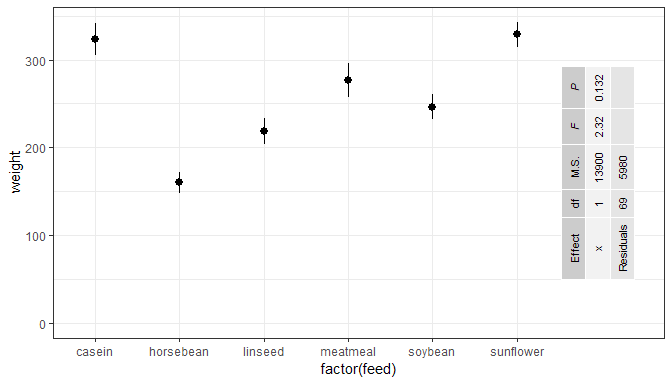


```r
formula <- y ~ x + I(x^2) + I(x^3)
ggplot(my.data, aes(x, y, color = group)) +
  geom_point() +
  stat_fit_augment(method = "lm", 
                   method.args = list(formula = formula))
```

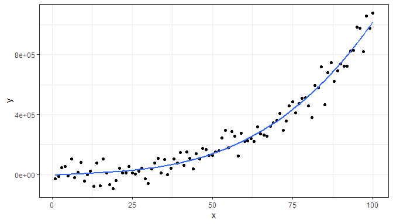

We can override the variable returned as `y` to be any of the variables in
the data frame returned by `broom::augment` while still preserving the original
`y` values.


```r
formula <- y ~ x + I(x^2) + I(x^3)
ggplot(my.data, aes(x, y)) +
  stat_fit_augment(method = "lm",
                   method.args = list(formula = formula),
                   geom = "point",
                   y.out = ".resid")
```


```r
formula <- y ~ x + I(x^2) + I(x^3)
ggplot(my.data, aes(x, y, color = group)) +
  stat_fit_augment(method = "lm",
                   method.args = list(formula = formula),
                   geom = "point",
                   y.out = ".std.resid")
```

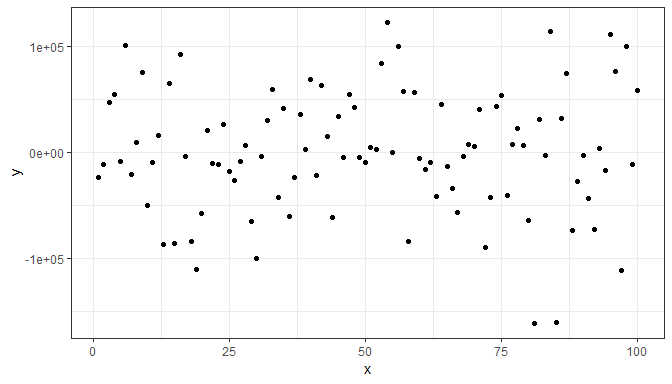

We can use any model fitting method for which `augment` is implemented.


```r
args <- list(formula = y ~ k * e ^ x,
             start = list(k = 1, e = 2))
ggplot(mtcars, aes(wt, mpg)) +
  geom_point() +
  stat_fit_augment(method = "nls",
                   method.args = args)
```

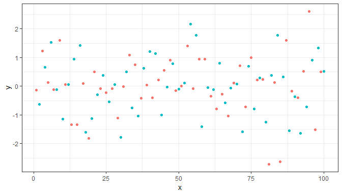


```r
args <- list(formula = y ~ k * e ^ x,
             start = list(k = 1, e = 2))
ggplot(mtcars, aes(wt, mpg)) +
  stat_fit_augment(method = "nls",
                   method.args = args,
                   geom = "point",
                   y.out = ".resid")
```


```r
args <- list(model = y ~ SSlogis(x, Asym, xmid, scal),
             fixed = Asym + xmid + scal ~1,
             random = Asym ~1 | group,
             start = c(Asym = 200, xmid = 725, scal = 350))
ggplot(Orange, aes(age, circumference, color = Tree)) +
  geom_point() +
  stat_fit_augment(method = "nlme",
                   method.args = args,
                   augment.args = list(data = quote(data)))
```

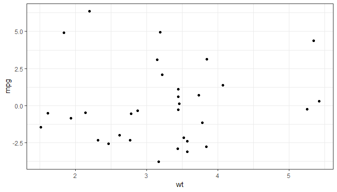

## stat_dens2d_labels and stat_dens2d_filter

These stats had their origin in an enhancement suggestion for 'ggrepel' from 
Hadley Wickham and discussion with Kamil Slowikowski (ggrepel's author) and 
others. In fact the code is based on code Kamil gave during the discussion,
but simplified and taking a few further ideas from `ggplot::stat_dens2d`.

**Warning!** Which observations are selected by the algorithm used, based on 
`MASS:kde2d`, depends strongly on the values of parameters `h` and `n`. You may need to alter the defaults by passing explicit arguments to these stats. Beware, though, that what are good values, may depend on individual data sets even if they include the same number of observations. For the selection of observations to work cleanly, the argument for `n` must create a dense grid. Much larger values of `n` than in the examples in the documentation of `MASS::kde2d` and `ggplot2::stat_dens2d` will be needed in most cases.

Some random data with random labels.


```r
random_string <- function(len = 6) {
paste(sample(letters, len, replace = TRUE), collapse = "")
}

# Make random data.
set.seed(1001)
d <- tibble::tibble(
  x = rnorm(100),
  y = rnorm(100),
  group = rep(c("A", "B"), c(50, 50)),
  lab = replicate(100, { random_string() })
)
```

### stat_dens2d_filter

The stat `stat_dens2d_filter` _filters_ observations, in other words passes to 
the geom a subset of the data received as input. The default value for `geom` is
`"point"`.

Using defaults except for the color aesthetic. Highlight 1/10 of observations 
from lowest density areas of the plot panel.


```r
ggplot(data = d, aes(x, y)) +
  geom_point() +
  stat_dens2d_filter(color = "red")
```


Highlighting  1/4 of the observations by under-plotting with larger black points.


```r
ggplot(data = d, aes(x, y, color = group)) +
   stat_dens2d_filter(keep.fraction = 0.25,
                      size = 3,
                      color = "black") +
   geom_point()
```

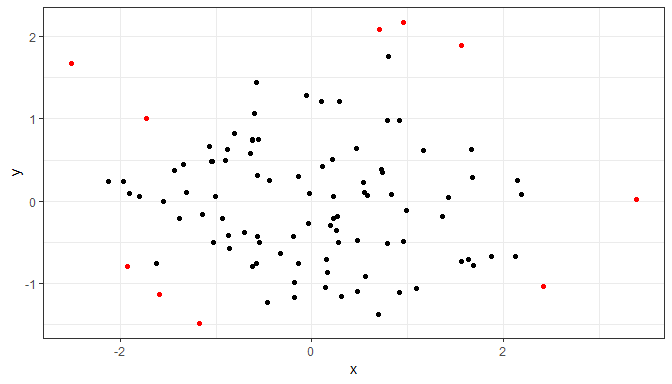

A different way of highlighting 1/4 of the observations, using over-plotting with
a 'hollow' shape. We also shift one group with respect to the other.


```r
ggplot(data = d, aes(x + rep(c(-2,2), rep(50,2)), 
                     y, color = group)) +
   geom_point() +
   stat_dens2d_filter(shape = 1, size = 3,
                      keep.fraction = 0.25)
```

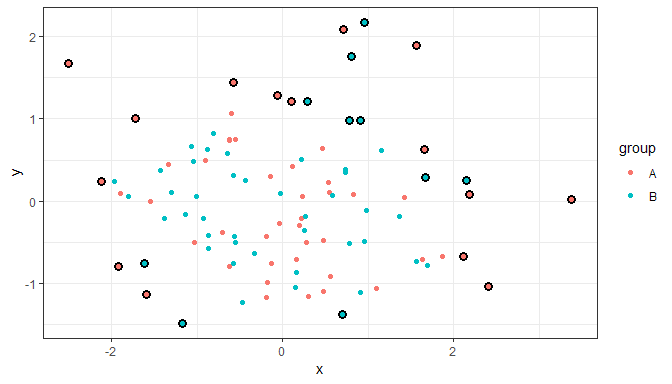

Highlight 1/4 of observations from lowest density areas of the plot, with
density considered separately for each individual group. In this case grouping
is based on the color aesthetic.


```r
ggplot(data = d, aes(x + rep(c(-2,2), rep(50,2)), 
                     y, color = group)) +
   geom_point() +
   stat_dens2d_filter_g(shape = 1, size = 3,
                      keep.fraction = 0.25)
```

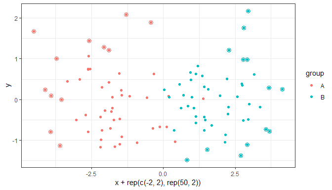

Add text labels to 1/10 of the observations. The "text_repel" geom sees only
these observations.


```r
ggplot(data = d, aes(x, y, label = lab, color = group)) +
  geom_point() + 
  stat_dens2d_filter(geom = "text_repel")
```

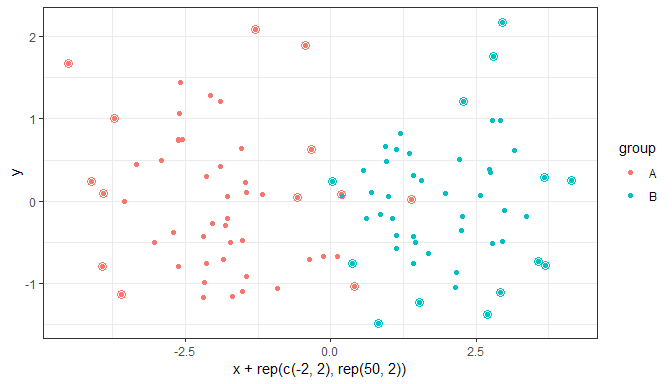

Add text labels to 1/2 of the observations. 


```r
ggplot(data = d, aes(x, y, label = lab, color = group)) +
  geom_point() +
  stat_dens2d_filter(geom = "text_repel", keep.fraction = 0.5)
```

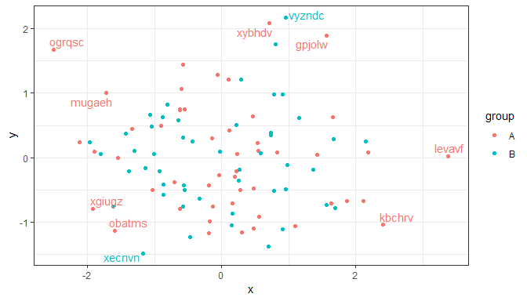

### stat_dens2d_labels

The stat `stat_dens2d_labels` _replaces_ the values of the 
label (aesthetic) variable in data in the high density regions of the panel with the argument passed to `label.fill` before passing them to the geom. The default value for `geom` is `"text"`. The default value of `label.fill` is `""` which results in empty labels, while using `NA` as fill label results in observations being omitted. Using `NA` as `label.fill` is not too different from using `stat_dens2d_filter` as long as the geom used requires a `label` aesthetic.

Label 1/10 of observations from lowest density areas of the plot panels.


```r
ggplot(data = d, aes(x, y, label = lab, color = group)) +
  geom_point() +
  stat_dens2d_labels()
```

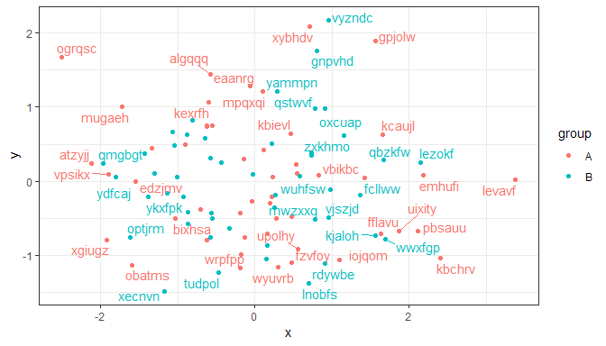

Add text labels to 45% of the observations. 


```r
ggplot(data = d, aes(x, y, label = lab, color = group)) +
  geom_point() +
  stat_dens2d_labels(keep.fraction = 0.45)
```

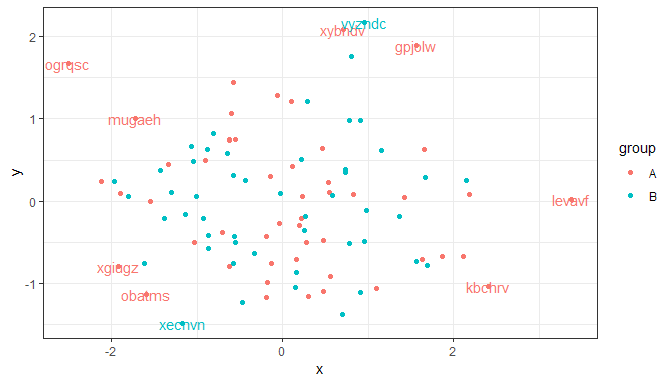

When using geom `"text"` we can statically adjust the positioning of labels, but
this is rarely enough even when keeping 1/4 of the labels.


```r
ggplot(data = d, aes(x, y, label = lab, color = group)) +
  geom_point() +
  stat_dens2d_labels(keep.fraction = 0.25,
                     vjust = -0.3)
```

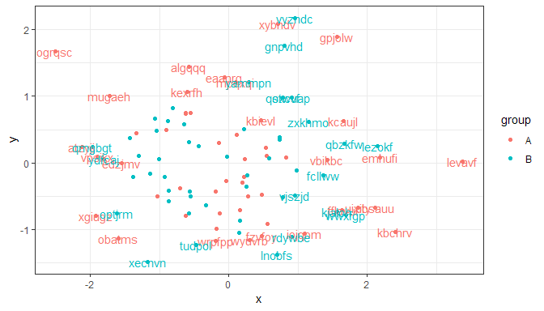

Using the geoms from package 'ggrepel' avoids clashes among labels or on top of
data points. This works with versions 0.6.0 and newer of 'ggrepel'. One example
with `geom_text_repel` follows.


```r
ggplot(data = d, aes(x, y, label = lab, color = group)) +
  geom_point() +
  stat_dens2d_labels(geom = "text_repel", 
                     keep.fraction = 0.45)
```

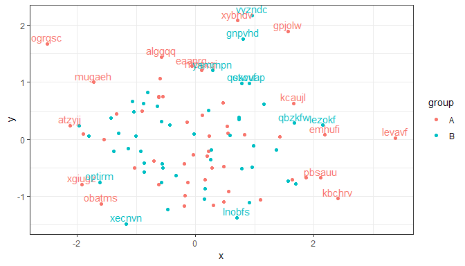

With `geom_label_repel` one needs to use a smaller value for `keep.fracton`, or
a smaller `size`, as labels use more space on the plot than the test alone.


```r
ggplot(data = d, aes(x, y, label = lab, color = group)) +
  geom_point() +
  stat_dens2d_labels(geom = "label_repel", 
                     keep.fraction = 0.25)
```

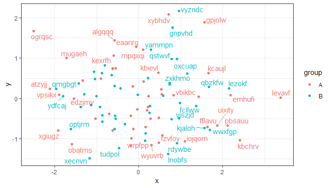

Additional arguments can be used to change the angle and position of the text,
but may give unexpected output when labels are long as the repulsion algorithm
"sees" always a rectangular bounding box that is not rotated. With short labels
or angles that are multiples of 90 degrees, there is no such problem.


```r
ggplot(data = d, aes(x, y, label = lab, color = group)) +
geom_point() +
stat_dens2d_labels(geom = "text_repel",
keep.fraction = 0.25, angle = 90)
```

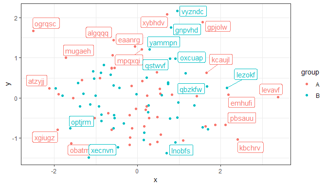

Using `NA` as fill makes the observations with labels set to `NA` to be skipped
completely, possibly leading to text overlapping the points corresponding to
unlabelled observations around the boundary of the regions where labels are kept
or discarded. We use here `alpha` so that the overlaps can be seen.


```r
ggplot(data = d, aes(x, y, label = lab, color = group)) +
  geom_point() +
  stat_dens2d_labels(geom = "label_repel", 
                     keep.fraction = 0.35, 
                     alpha = 0.5,
                     label.fill = NA)
```

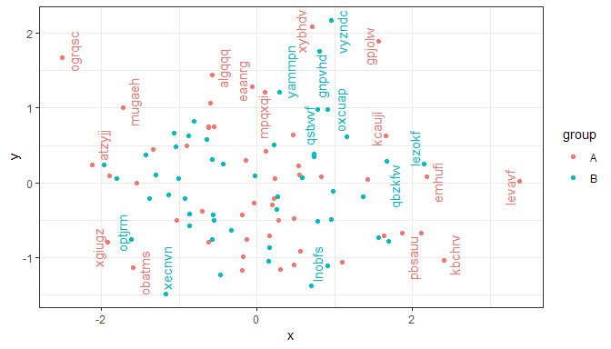

## try_tibble

### Time series

Several different formats for storing time series data are used in R. Here we
use in the examples objects of class `ts` but several other classes are
supported as `try.xts()` is used internally. The first example is a quarterly
series.


```r
class(austres)
```

```
## [1] "ts"
```

```r
austres.df <- try_tibble(austres)
class(austres.df)
```

```
## [1] "tbl_df"     "tbl"        "data.frame"
```

```r
lapply(austres.df, "class")
```

```
## $time
## [1] "POSIXct" "POSIXt" 
## 
## $x
## [1] "numeric"
```

```r
head(austres.df, 4)
```

```
## # A tibble: 4 x 2
##   time                     x
##   <dttm>               <dbl>
## 1 1971-04-01 00:00:00 13067.
## 2 1971-07-01 00:00:00 13130.
## 3 1971-10-01 00:00:00 13198.
## 4 1972-01-01 00:00:00 13254.
```

The next chunk demonstrates that numeric times are expressed as decimal years in
the returned data frame.


```r
austres.df <- try_tibble(austres, as.numeric = TRUE)
lapply(austres.df, "class")
```

```
## $time
## [1] "numeric"
## 
## $x
## [1] "numeric"
```

```r
head(austres.df, 4)
```

```
## # A tibble: 4 x 2
##    time      x
##   <dbl>  <dbl>
## 1 1971. 13067.
## 2 1972. 13130.
## 3 1972. 13198.
## 4 1972  13254.
```

This second example is for a series of yearly values.


```r
class(lynx)
```

```
## [1] "ts"
```

```r
lynx.df <- try_tibble(lynx)
class(lynx.df)
```

```
## [1] "tbl_df"     "tbl"        "data.frame"
```

```r
lapply(lynx.df, "class")
```

```
## $time
## [1] "POSIXct" "POSIXt" 
## 
## $x
## [1] "numeric"
```

```r
head(lynx.df, 3)
```

```
## # A tibble: 3 x 2
##   time                    x
##   <dttm>              <dbl>
## 1 1820-02-01 00:00:00   269
## 2 1821-02-01 00:00:00   321
## 3 1822-02-01 00:00:00   585
```

Above there is a small rounding error of 1 s for these old dates. We can correct
this by rounding to year.


```r
lynx.df <- try_tibble(lynx, "year")
head(lynx.df, 3)
```

```
## # A tibble: 3 x 2
##   time                    x
##   <dttm>              <dbl>
## 1 1821-01-01 00:00:00   269
## 2 1822-01-01 00:00:00   321
## 3 1823-01-01 00:00:00   585
```

In addition we can convert the POSIXct values into numeric values in calendar
years plus a decimal fraction.


```r
lynx_n.df <- try_tibble(lynx, "year", as.numeric = TRUE)
lapply(lynx_n.df, "class")
```

```
## $time
## [1] "numeric"
## 
## $x
## [1] "numeric"
```

```r
head(lynx_n.df, 3)
```

```
## # A tibble: 3 x 2
##    time     x
##   <dbl> <dbl>
## 1  1821   269
## 2  1822   321
## 3  1823   585
```

### Other classes

`try_tibble()` attempts to handle gracefully objects that are not time series.


```r
try_tibble(1:5)
```

```
## # A tibble: 5 x 1
##       x
##   <int>
## 1     1
## 2     2
## 3     3
## 4     4
## 5     5
```


```r
try_tibble(letters[1:5])
```

```
## # A tibble: 5 x 1
##   x    
##   <fct>
## 1 a    
## 2 b    
## 3 c    
## 4 d    
## 5 e
```


```r
try_tibble(factor(letters[1:5]))
```

```
## # A tibble: 5 x 1
##   x    
##   <fct>
## 1 a    
## 2 b    
## 3 c    
## 4 d    
## 5 e
```


```r
try_tibble(list(x = rep(1,5), y = 1:5))
```

```
## # A tibble: 5 x 2
##       x     y
##   <dbl> <int>
## 1     1     1
## 2     1     2
## 3     1     3
## 4     1     4
## 5     1     5
```


```r
try_tibble(data.frame(x = rep(1,5), y = 1:5))
```

```
## # A tibble: 5 x 2
##       x     y
##   <dbl> <int>
## 1     1     1
## 2     1     2
## 3     1     3
## 4     1     4
## 5     1     5
```


```r
try_tibble(matrix(1:10, ncol = 2))
```

```
## # A tibble: 5 x 2
##      V1    V2
##   <int> <int>
## 1     1     6
## 2     2     7
## 3     3     8
## 4     4     9
## 5     5    10
```

## Appendix: Additional examples of the use density filtering

We define a function to simplify the generation of random data sets.


```r
make_data_tbl <- function(nrow = 100, rfun = rnorm, ...) {
  if (nrow %% 2) {
    nrow <- nrow + 1
  }
  
  set.seed(1001)
  
  tibble::tibble(
    x = rfun(nrow, ...),
    y = rfun(nrow, ...),
    group = rep(c("A", "B"), c(nrow / 2, nrow / 2))
  )
}
```

As we will draw many points on the plotting area we change the default theme
to an uncluttered one.


```r
old_theme <- theme_set(theme_bw())
```

In all the examples in this vignette we use colours to demonstrate which data points are selected, but any other suitable aesthetic and discrete scale can be used instead. With `keep.sparse = FALSE` we keep 1/3 of the observations in the denser region of the plot. Although here we first plot all data points and later overplot the selected ones this is not necessary.


```r
ggplot(data = make_data_tbl(300), aes(x, y)) +
  geom_point() +
  stat_dens2d_filter(color = "red", 
                     keep.sparse = FALSE, 
                     keep.fraction = 1/3)
```


Here we highlight the observations split in three group equal groups, each of a
different density of observations.


```r
ggplot(data = make_data_tbl(300), aes(x, y)) +
  geom_point() +
  stat_dens2d_filter(color = "red", 
                     keep.sparse = FALSE, 
                     keep.fraction = 1/3)+
  stat_dens2d_filter(color = "blue", 
                     keep.fraction = 1/3)
```

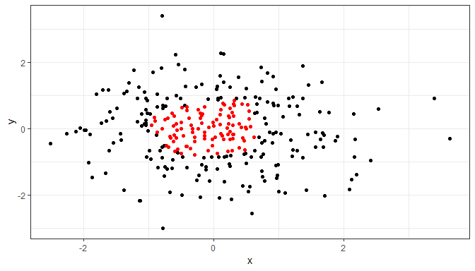

The algorithm seems to work well also with other distributions, in this example the uniform distribution.


```r
ggplot(data = make_data_tbl(300, rfun = runif), aes(x, y)) +
  geom_point() +
  stat_dens2d_filter(color = "red", keep.fraction = 1/2)
```

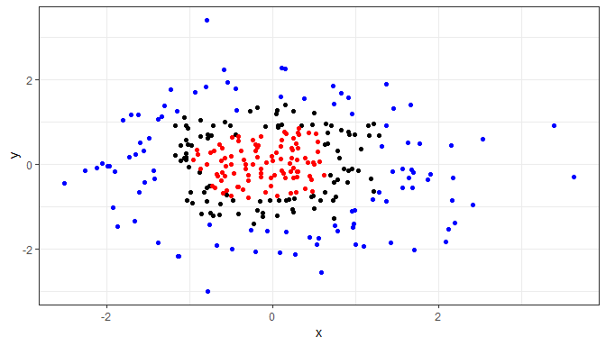

One example with the gamma distribution, which is asymmetric.


```r
ggplot(data = make_data_tbl(300, rfun = rgamma, shape = 2), 
       aes(x, y)) +
  geom_point() +
  stat_dens2d_filter(color = "red", keep.fraction = 1/3)
```

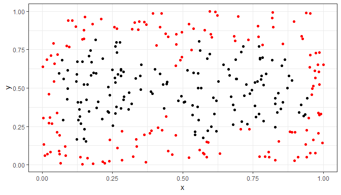
